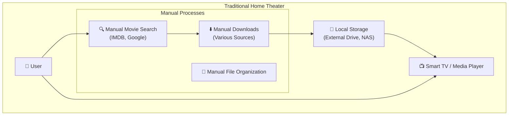
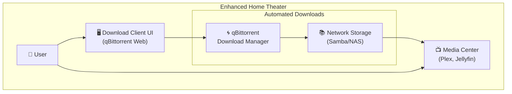
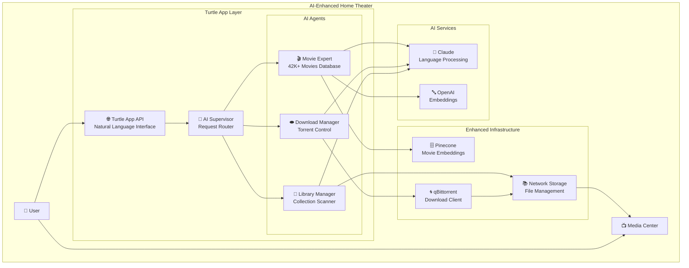
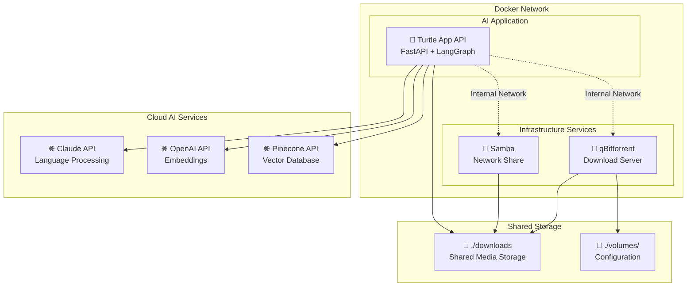
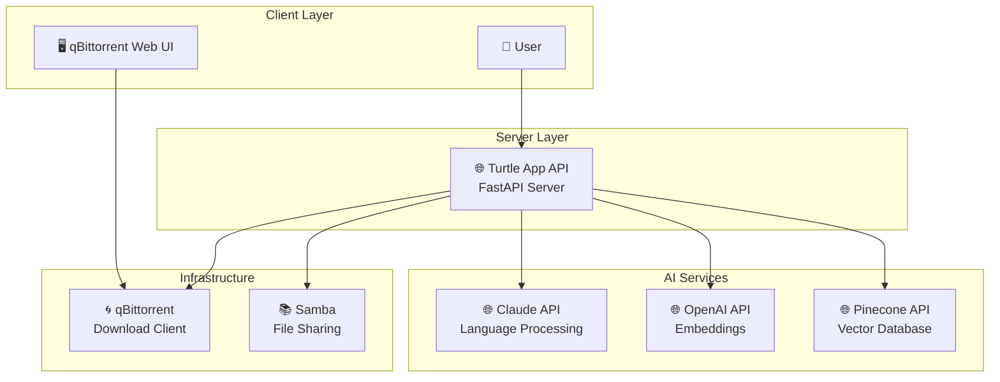
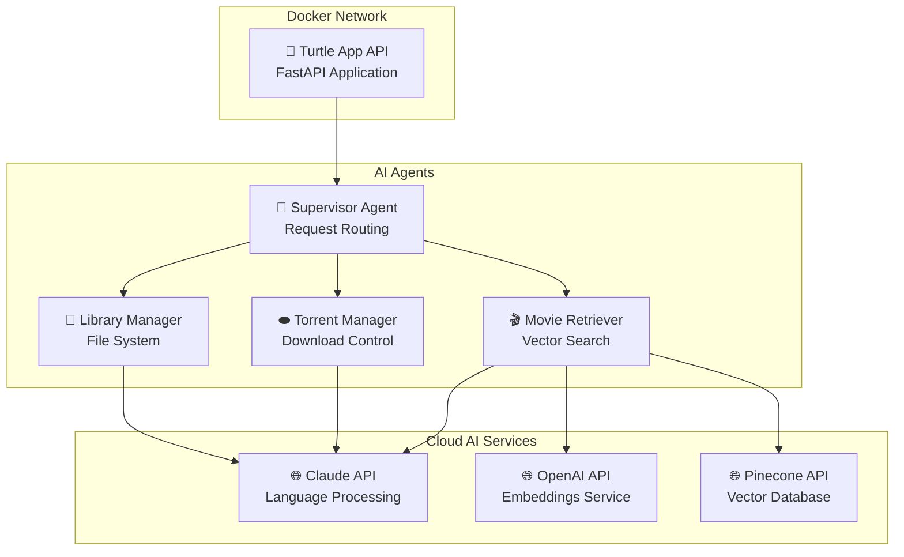
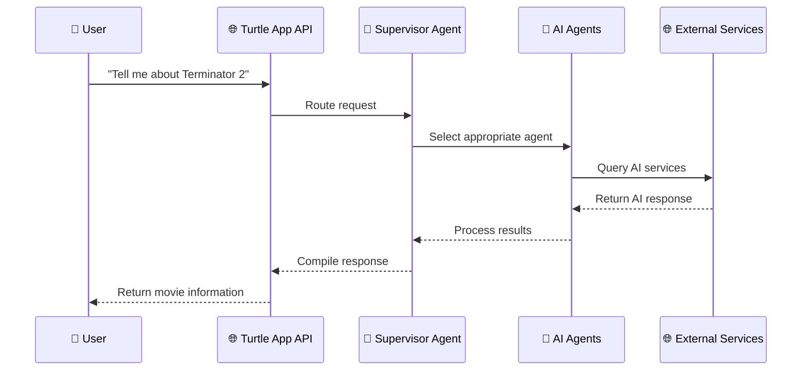
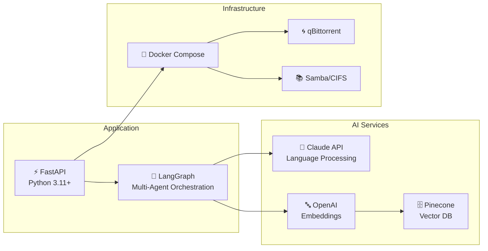

# 🏠 Home Theater Architecture

This document provides a progressive overview of home theater architectures, starting from a basic client perspective and showing how the Turtle App enhances the experience.

## 🎭 The Traditional Home Theater Setup

### What Most People Start With



**The Challenge**: Users manually search for movies, manage downloads, organize files, and remember what they have in their collection. It's time-consuming and fragmented.

## 🚀 Enhanced Home Theater with Download Automation

### Adding Download Management



**The Improvement**: Centralized download management with a web interface, automatic file organization, and network storage accessible by multiple devices.

**Remaining Challenges**: 
- Still need to manually search for content
- No intelligent recommendations
- Can't easily query "What movies do I have?"
- No conversation memory or context

## 🤖 AI-Powered Home Theater with Turtle App

### The Complete Solution



**The Transformation**: 
- **Natural Language Interface**: "Find me a sci-fi movie like Blade Runner"
- **Intelligent Recommendations**: AI-powered suggestions based on 42,000+ movie database
- **Automated Management**: AI agents handle downloads, library scanning, and organization
- **Conversation Memory**: Maintains context across multiple interactions
- **Unified Control**: Single interface for movie discovery, downloads, and library management

### Real-World Usage Examples

**Movie Night Planning**:
```
User: "I want to watch something like Inception"
Turtle App: "Found similar movies: The Matrix, Dark City, Shutter Island. 
            You already have The Matrix in your library. 
            Would you like me to download Dark City?"
```

**Library Management**:
```
User: "What sci-fi movies do I have?"
Turtle App: "You have 23 sci-fi movies including: Blade Runner, The Matrix, 
            Interstellar... Would you like the full list or recommendations?"
```

**Download Automation**:
```
User: "Download the latest Marvel movie"
Turtle App: "Found 'Guardians of the Galaxy Vol. 3' (2023). 
            Starting download... Current progress: 15% complete."
```

## 🐳 Docker Implementation Architecture

### How It All Works Together



## 🖥️ Client-Server Architecture

### Communication Flow



## 🤖 LLM Client-Server Architecture

### AI Service Integration



## 🔄 Complete System Flow

### User Request to Response



## 🛠️ Technology Stack

### Core Components



## 🎯 Key Features

### What the System Does

1. **🎬 Movie Information**: Query 42,000+ movie database with AI-powered search
2. **⬬ Download Management**: Control qBittorrent for movie file downloads
3. **📁 Library Management**: Scan and organize local movie collection
4. **🤖 AI Orchestration**: Multi-agent system with specialized AI agents
5. **🌐 Web API**: RESTful endpoints for external integration

### How It Works

1. **User sends request** to FastAPI endpoint
2. **Supervisor Agent** routes request to appropriate specialized agent
3. **Specialized Agents** handle specific tasks (movies, downloads, library)
4. **External AI Services** provide language processing and vector search
5. **Infrastructure Services** manage downloads and file storage
6. **Response returned** to user with comprehensive information

This architecture provides a clean, scalable foundation for AI-powered home theater management with clear separation between Docker infrastructure, AI services, and application logic. 