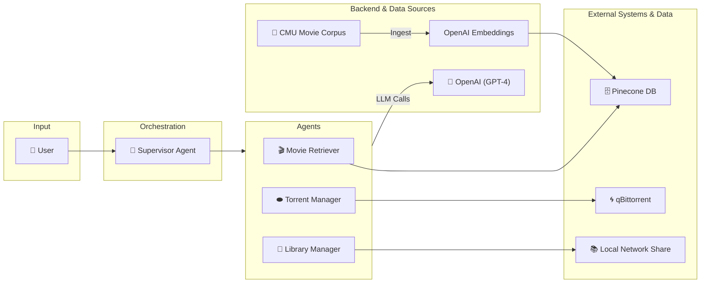
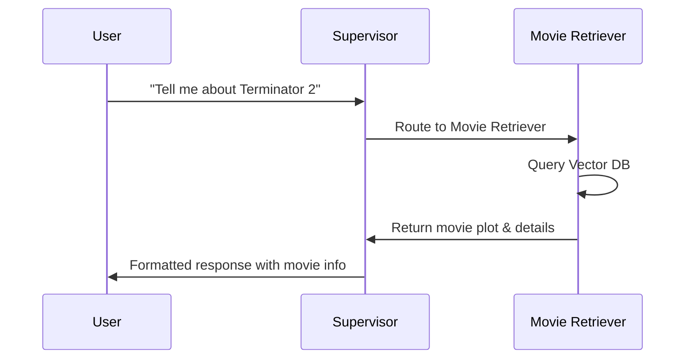
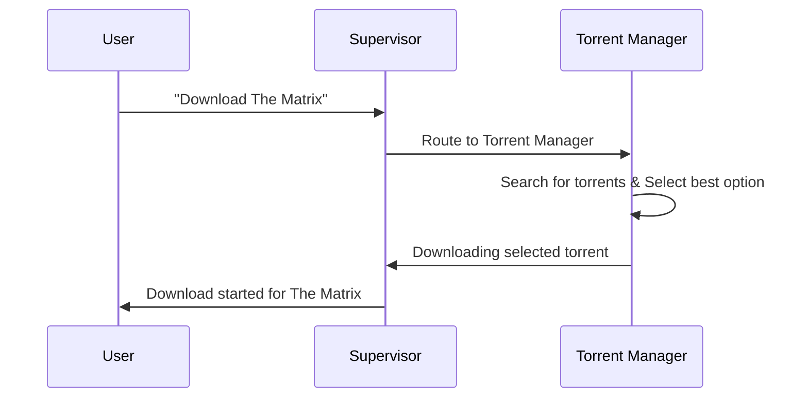
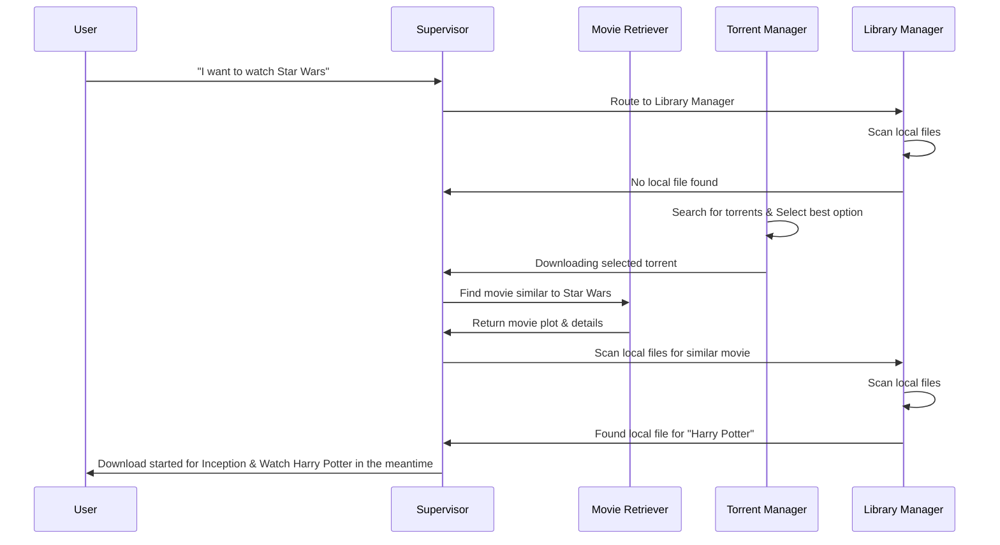

# 🎬 Turtle App - AI-Powered Home Theater Assistant

Every movie night starts the same, you spend hours searching for the perfect film, only to end up watching the same old favorites. **Turtle App is here to change that!**

This is a management system that combines Large Language Models (LLMs), Retrieval Augmented Generation (RAG), and multi-agent orchestration to provide a unified interface for managing your personal movie collection, discovering new content, and controlling media downloads.

## 🎯 What Does This Do?

The Turtle App is your personal AI assistant for home theater management. It can:

- **🔍 Answer questions about movies** using a comprehensive database of movie summaries and metadata
- **💾 Manage your local movie library** by scanning and indexing your collection
- **⬬ Handle torrent downloads** through integration with qBittorrent
- **🤖 Maintain conversation context** across multiple interactions
- **🌐 Deploy as a web service** with both local and cloud deployment options

## 🏗️ Architecture Overview

The system uses a **multi-agent supervisor architecture** built on LangGraph, where specialized agents handle different aspects of home theater management under the coordination of a supervisor agent.

## 🔧 Components Deep Dive

### 🎯 Supervisor Agent
- **Role**: Central coordinator that routes user requests to appropriate specialized agents
- **Technology**: GPT-4 with structured output for intelligent routing decisions
- **Function**: Analyzes user intent and determines which agent should handle the request
- **Implementation**: `turtleapp/src/nodes/supervisor.py`

### 🎬 Movie Retriever Agent (RAG)
- **Role**: Answers questions about movies using semantic search
- **Data Source**: Pinecone vector database with 42,000+ movie summaries from CMU Movie Summary Corpus
- **Capabilities**:
  - Movie plot summaries and analysis
  - Movie recommendations based on genre, cast, or plot similarity
  - Metadata retrieval (cast, director, year, genre)
  - Semantic search across movie descriptions
- **Implementation**: `turtleapp/src/core/tools/movie_summaries_retriever.py`
- **Testing**: `turtleapp/tests/test_retriever.py`

### ⬬ Torrent Manager Agent
- **Role**: Manages torrent downloads and searches
- **Integration**: qBittorrent Web API
- **Capabilities**:
  - List currently downloading torrents
  - Search for torrents across multiple providers
  - Add torrents via magnet links
  - Monitor download progress
- **Implementation**: `turtleapp/src/core/tools/torrent_tools.py`
- **Testing**: `turtleapp/tests/test_torrent.py`

### 📁 Library Manager Agent
- **Role**: Scans and catalogs local movie library
- **Integration**: Samba/CIFS network shares
- **Capabilities**:
  - Scan network shares for movie files
  - Generate library catalog with file paths
- **Implementation**: `turtleapp/src/core/tools/library_manager.py`
- **Testing**: `turtleapp/tests/test_library_manager.py`

### 🔄 Workflow Orchestration
- **Implementation**: `turtleapp/src/workflows/graph.py`
- **Technology**: LangGraph for multi-agent orchestration
- **Components**:
  - State management using `MessagesState`
  - Memory persistence with `MemorySaver`
  - Agent routing and coordination

## 💬 Usage Examples

### Movie Information & Recommendations

### Torrent Management

### Movie Night Management

## 🛠️ Technology Stack

### Core Framework

- **LangGraph**: Multi-agent orchestration and workflow management
- **LangChain**: LLM integration and tool chaining
- **OpenAI GPT-4**: Primary language model for reasoning and responses
- **Python 3.11+**: Core application runtime

### Data & Storage

- **Pinecone**: Vector database for movie embeddings
- **OpenAI Embeddings**: Text vectorization for semantic search
- **Memory Saver**: Conversation persistence and context management

### External Integrations

- **qBittorrent Web API**: Torrent client management
- **Samba/CIFS**: Network file share access
- **FastAPI**: RESTful API endpoints (planned)

### Development & Deployment

- **Poetry**: Dependency management and packaging
- **LangSmith**: Model monitoring, evaluation, prompt management
- **Docker**: Containerization for deployment
- **Testing**: Combination of unit tests for core functionality and LangSmith monitoring for LLM-based components

## 🎯 Current Features & Roadmap

### 🚧 In Development

- **🔄 Enhanced Integration**
  - [ ] Real-time torrent progress monitoring
  - [ ] Automatic library refresh after downloads
  - [ ] Cross-platform media player integration
  - [ ] Subtitle and metadata management

### 🗺️ Future Roadmap

- **📱 User Interfaces**
  - [ ] Telegram bot integration for mobile access
  - [ ] Web-based dashboard with Streamlit

- **🧠 AI Enhancements**
  - [ ] Self-hosted LLM support (Ollama, DeepSeek R1)
  - [ ] Multi-modal support (movie posters, trailers)
  - [ ] Sentiment analysis of user preferences

- **📊 Analytics & Optimization**
  - [ ] Usage analytics and recommendation improvement
  - [ ] Token cost optimization strategies
