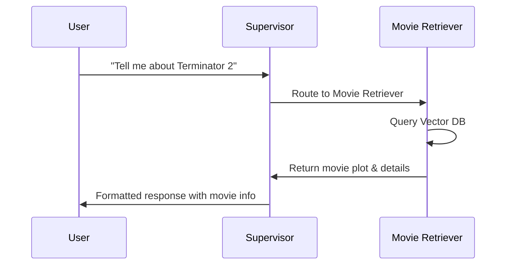
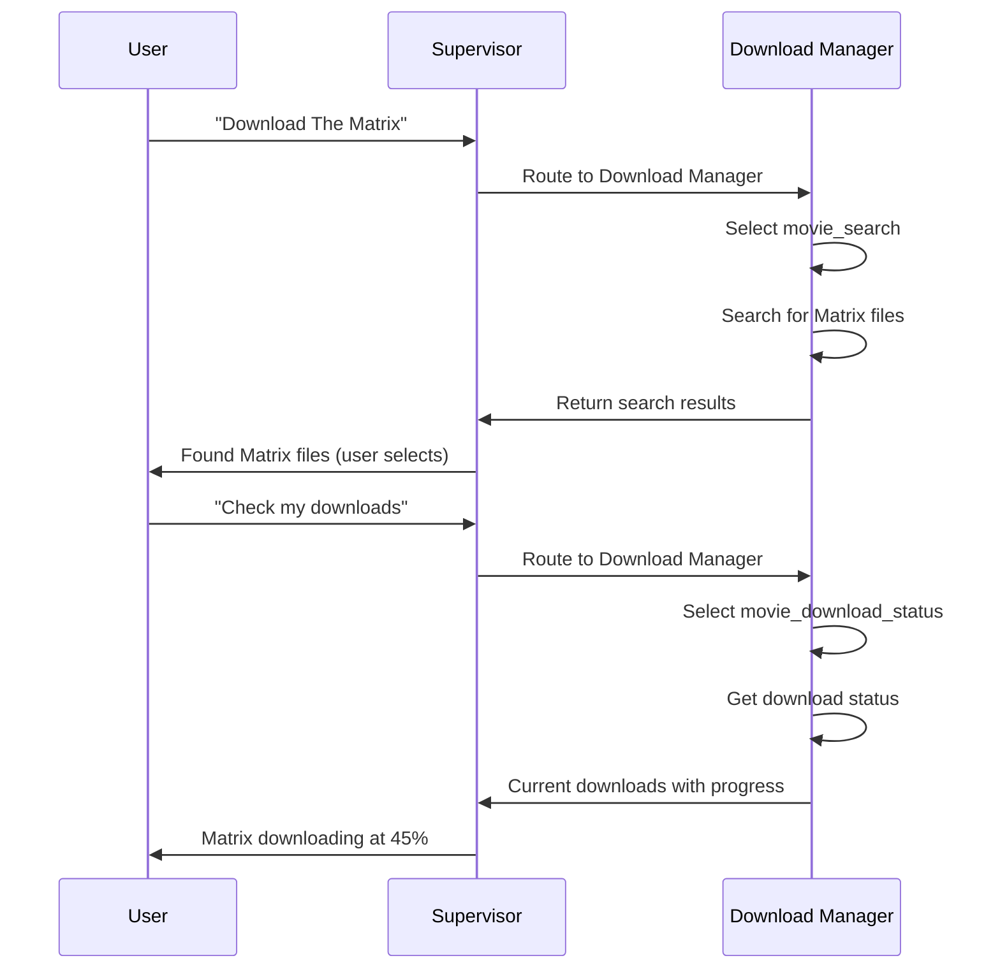
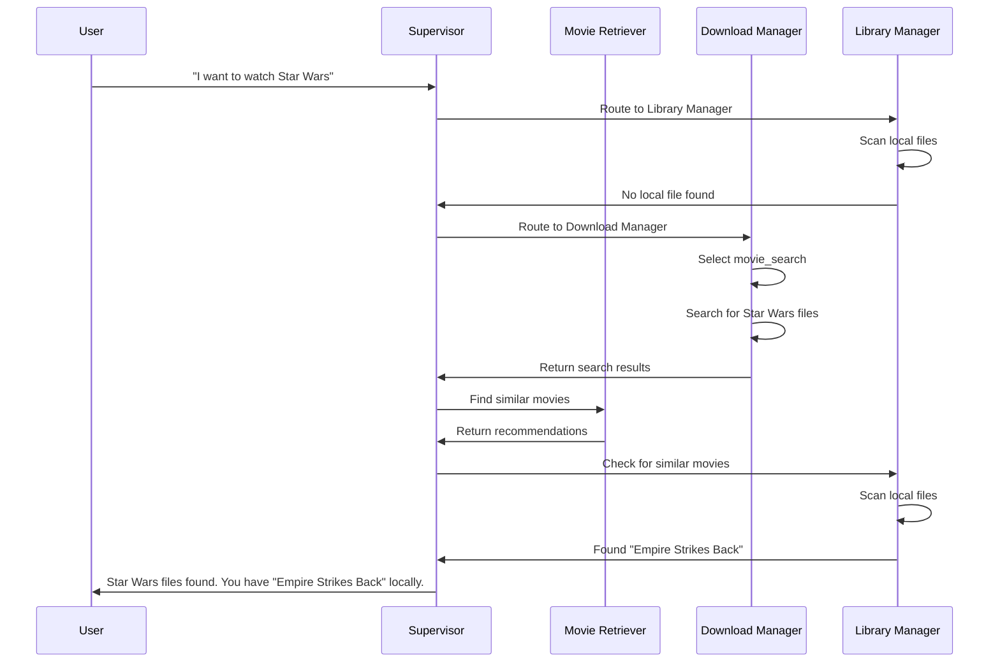

# 🎬 Turtle App - AI-Powered Home Theater Assistant

Every movie night starts the same, you spend hours searching for the perfect film, only to end up watching the same old favorites. **Turtle App is here to change that!**

This is a management system that combines Large Language Models (LLMs), Retrieval Augmented Generation (RAG), and multi-agent orchestration to provide a unified interface for managing your personal movie collection, discovering new content, and controlling media downloads.

## 🎯 What Does This Do?

The Turtle App is your personal AI assistant for home theater management. It can:

- **🔍 Answer questions about movies** using a comprehensive database of movie summaries and metadata
- **💾 Manage your local movie library** by scanning and indexing your collection
- **⬬ Handle movie downloads** through integration with download client
- **🤖 Maintain conversation context** across multiple interactions
- **🌐 Deploy as a web service** with RESTful API endpoints

## 🏗️ Architecture Overview

The system uses a **multi-agent supervisor architecture** built on LangGraph, where specialized agents handle different aspects of home theater management under the coordination of a supervisor agent.


## 🔧 Components Deep Dive

### 🔄 Workflow Orchestration
- **Implementation**: `turtleapp/src/workflows/graph.py`
- **Technology**: LangGraph for multi-agent orchestration
- **Components**:
  - State management using `MessagesState`
  - Memory persistence with `MemorySaver` (upgraded from InMemorySaver)
  - Agent routing and coordination
  - **Sync-Only Execution**: Fully synchronous workflow compatible with Jupyter notebooks, CLI, and tests
  - **Encapsulated Invocation**: `invoke()` method for consistent config management
- **Main Instances**: 
  - `movie_workflow_agent` (WorkflowGraph instance with helper methods)
  - `movie_workflow_graph` (CompiledStateGraph for direct access)

### 🎯 Supervisor Agent
- **Role**: Central coordinator that routes user requests to appropriate specialized agents
- **Technology**: Claude 3.5 Sonnet with custom-engineered routing prompts for intelligent decision making
- **Function**: Analyzes user intent and determines which agent should handle the request using explicit routing rules
- **Key Features**:
  - **Custom Routing Logic**: Replaced external hub dependency with domain-specific routing criteria
  - **Clear Decision Rules**: Explicit rules for routing to movie retrieval, torrent management, or library scanning
  - **Context-Aware**: Understands home theater management domain for better routing decisions
  - **Robust Prompt Management**: Centralized prompts in Python modules for reliability and maintainability
- **Implementation**: `turtleapp/src/nodes/supervisor.py`
- **Prompts**: `turtleapp/src/core/prompts/supervisor.py`

### 🎬 Movie Retriever Agent (RAG)
- **Role**: Movie database expert with specialized knowledge of 42,000+ movie summaries
- **Data Source**: Pinecone vector database with CMU Movie Summary Corpus
- **Agent Specialization**:
  - **Domain Expertise**: Specialized prompt with movie database knowledge and search best practices
  - **Tool Usage Guidelines**: Clear instructions for semantic search parameter optimization
  - **Step-by-Step Approach**: Structured process for extracting search terms and presenting results
  - **Robust Prompt Management**: Centralized agent prompts in Python modules for consistency
- **Capabilities**:
  - Movie plot summaries and analysis
  - Movie recommendations based on genre, cast, or plot similarity
  - Metadata retrieval (cast, director, year, genre)
  - Semantic search across movie descriptions
- **Enhanced Tool Description**: Comprehensive usage guidelines with examples and parameter recommendations
- **Implementation**: `turtleapp/src/core/tools/movie_summaries_retriever.py`
- **Tool Name**: `movie_retriever_tool`
- **Prompts**: `turtleapp/src/core/prompts/agents.py` (MOVIE_RETRIEVER_PROMPT)
- **Testing**: `turtleapp/tests/test_retriever.py`

### ⬬ Movie Download Manager Agent
- **Role**: Movie download management expert specializing in movie file acquisition
- **Integration**: Download client Web API
- **Architecture**: Single agent with multiple specialized tools and intelligent routing
- **Agent Specialization**:
  - **Domain Expertise**: Specialized prompt with download management knowledge and best practices
  - **Quality Preferences**: Guidance for preferring higher quality (1080p+) and well-sourced files
  - **Tool Coordination**: Clear approach for determining user intent (search vs. status check)
- **Capabilities**:
  - **Download monitoring**: List currently downloading movies with progress status
  - **Movie search**: Search for movie files by title or keyword
  - **Intelligent routing**: ReAct agent automatically selects appropriate tool based on user intent
  - **Natural language interface**: Handles queries like "check downloads" or "search for Matrix"
- **Enhanced Tool Descriptions**:
  - `movie_download_status`: Detailed status information with progress, speeds, and ETA
  - `movie_search`: Comprehensive search guidance with quality info and best practices
- **Implementation**: `turtleapp/src/core/tools/torrent_tools.py`
- **Prompts**: `turtleapp/src/core/prompts/agents.py` (TORRENT_MANAGER_PROMPT)
- **Testing**: `turtleapp/tests/test_torrent.py`

### 📁 Library Manager Agent
- **Role**: Local movie library specialist managing SMB network shares
- **Integration**: Samba/CIFS network shares
- **Agent Specialization**:
  - **Domain Expertise**: Specialized prompt with library management and file organization knowledge
  - **Analytics Focus**: Guidance for providing useful library statistics and insights
  - **Organization Suggestions**: Capability to suggest library improvements when relevant
- **Capabilities**:
  - Scan network shares for movie files
  - Generate library catalog with file paths
  - File format analysis and reporting
  - Library statistics and organization insights
- **Enhanced Tool Description**: Comprehensive guidance for library operations with supported formats and statistics
- **Implementation**: `turtleapp/src/core/tools/library_manager.py`
- **Tool Name**: `library_manager_tool`
- **Prompts**: `turtleapp/src/core/prompts/agents.py` (AGENT_BASE_PROMPT - direct node implementation)
- **Testing**: `turtleapp/tests/test_library_manager.py`

### 🌐 API Layer
- **Implementation**: `turtleapp/api/routes/endpoints.py`
- **Technology**: FastAPI with synchronous endpoints
- **Endpoints**: 
  - `POST /chat` - Main conversation endpoint
  - `GET /health` - Health check endpoint
- **Features**: Thread management, request validation, structured responses
- **Deployment**: Available via Poetry script `turtle-app-ep`

### 🛠️ Core Utilities

**LLM Factory** (`turtleapp/src/core/llm_factory.py`):
- Uses settings for model selection and API key management

**Error Handling** (`turtleapp/src/utils/error_handler.py`):
- Standardized error handling decorators for tools and services
- Applied across all tool implementations

**Constants** (`turtleapp/src/constants.py`):
- Centralized configuration constants with `SUPERVISOR_NODE` and `DefaultValues`
- Node names, file extensions, and default values
- Eliminated verbose enum wrappers in favor of direct string literals

**Prompt Management** (`turtleapp/src/core/prompts/`):
- Centralized prompt storage in Python modules for reliability
- Path-independent prompt loading eliminates file system dependencies
- Type-safe imports with IDE support and import-time validation
- Modular organization: supervisor.py, agents.py, __init__.py

## 💬 Usage Examples

### Movie Information & Recommendations



### Movie Download Management



### Movie Night Management



## 🧠 Design Assumptions & Model Selection

### Why Different Models for Different Roles?

**Supervisor Agent: Claude 3.5 Sonnet**
- Handles complex reasoning and routing decisions
- Needs sophisticated understanding to route between agents correctly

**Tool Agents: Claude 3.5 Haiku** 
- Optimized for speed and cost on focused tasks
- Multiple calls per request, so cost efficiency matters
- Sufficient capability for single-domain operations (movies, downloads, library)

**Embeddings: OpenAI `text-embedding-3-large`**
- Claude doesn't offer embedding models yet
- OpenAI provides best-in-class semantic search for movie content
- 3072 dimensions give rich representation for movie plot similarity

This multi-model approach balances cost, performance, and quality across the system's different needs.

## 🛠️ Technology Stack

### Core Framework

- **LangGraph**: Multi-agent orchestration and workflow management
- **LangChain**: LLM integration and tool chaining
- **Claude 3.5 (Anthropic)**: Primary language model for reasoning and responses
  - Supervisor: Claude 3.5 Sonnet (`claude-3-5-sonnet-20241022`)
  - Agents: Claude 3.5 Haiku (`claude-3-5-haiku-20241022`)
- **Python 3.11+**: Core application runtime

### Data & Storage

- **Pinecone**: Vector database for movie embeddings
- **OpenAI Embeddings**: Text vectorization for semantic search (`text-embedding-3-large`)
- **DuckDB**: Local data processing and analytics
- **Pandas**: Data manipulation and analysis
- **Memory Saver**: Conversation persistence and context management

### External Integrations

- **Download Client Web API**: Movie download client management
- **Samba/CIFS (pysmb)**: Network file share access
- **FastAPI**: RESTful API endpoints with synchronous execution

### Development & Deployment

- **Poetry**: Dependency management and packaging
- **LangSmith**: Model monitoring, evaluation, prompt management
- **Docker**: Containerization for deployment
- **Testing**: Comprehensive test suite with pytest, async testing, and focused integration tests

## 🎯 Current Features & Roadmap

### ✅ Implemented Features

- **🤖 Multi-Agent System**: Fully functional supervisor with three specialized agents
- **🔍 Movie RAG System**: Vector search with 42,000+ movie summaries
- **⬬ Download Integration**: Download client API integration for movie file management
- **📁 Library Management**: SMB/CIFS network share scanning
- **🌐 REST API**: FastAPI endpoint for external interactions
- **💾 Data Pipeline**: Movie data processing and vector store upload
  - **Data Pipeline Manager** (`turtleapp/data_pipeline/vector_store/vector_store_manager.py`):
    - `MovieDataLoader`: Loads movie data from CSV files with configurable limits (default: 300 documents)
    - `PineconeVectorStoreManager`: Manages Pinecone index creation and document uploads
    - Batch processing with concurrent uploads for performance (100 docs/batch, 4 workers)
    - Automatic index creation with 3072-dimensional embeddings and cosine similarity
  - **Pipeline Runner** (`turtleapp/data_pipeline/vector_store/upload_script.py`):
    - Main script for executing the data pipeline
    - Handles the complete flow from data loading to vector store upload
    - Async processing for improved performance
  - **Data Storage** (`turtleapp/data_pipeline/data/processed/`):
    - `wiki_movie_plots_cleaned.csv`: Processed movie plot data from CMU Movie Summary Corpus
    - Contains movie summaries, metadata, and plot descriptions for vector embedding
- **🧪 Testing**: Comprehensive test suite for all core components
- **🏗️ Enhanced Architecture**: 
  - **Tool Organization**: Tools are now direct instances (`movie_retriever_tool`, `library_manager_tool`, etc.) wrapped by generic `ToolAgent` class
  - **Agent Reliability**: `AgentExecutor` with `handle_parsing_errors=True` and `max_iterations=3`
  - **Simplified Constants**: Removed unnecessary `ConfigKeys` enum in favor of direct string literals
  - **Graph Encapsulation**: `invoke()` method handles thread management and configuration

### 🚧 In Development

- **🔄 Enhanced Integration**
  - [ ] Real-time torrent progress monitoring
  - [ ] Automatic library refresh after downloads
  - [ ] Cross-platform media player integration
  - [ ] Subtitle and metadata management

### ✅ Recently Completed

- **🧠 Prompt Engineering Overhaul (Major)**
  - [x] **Custom Supervisor Prompt**: Replaced external hub dependency with domain-specific routing logic
  - [x] **Specialized Agent Prompts**: Created expert-level prompts for movie retrieval, torrent management, and library scanning
  - [x] **Enhanced Tool Descriptions**: Comprehensive tool guidance with use cases, examples, and best practices
  - [x] **Workflow Context**: Added multi-agent system awareness for better coordination
  - [x] **Domain Expertise**: Agents now understand their specialized roles in home theater management
  - [x] **Clear Decision Criteria**: Explicit routing rules for 30-50% reduction in failed iterations
  - [x] **Tool Usage Guidelines**: Step-by-step approaches and parameter optimization guidance
  - [x] **Robust Prompt Architecture**: Moved prompts from hardcoded strings to centralized Python modules (`turtleapp/src/core/prompts/`)
  - [x] **Path-Independent Loading**: Eliminated file system dependencies for improved reliability across environments
  - [x] **Type-Safe Prompt Management**: Import-time validation and IDE support for better development experience

- **🔧 Code Quality Improvements**
  - [x] **Constants Simplification**: Removed unnecessary `ConfigKeys` enum for cleaner, more direct code
  - [x] **Graph Encapsulation**: Added `invoke()` method for consistent invocation patterns
  - [x] **Tool Architecture**: Refactored tools to be direct instances wrapped by generic `ToolAgent` class
  - [x] **Enhanced Error Handling**: `AgentExecutor` with parsing error handling and iteration limits
  - [x] **LLM Factory Pattern**: Eliminated duplicate LLM initialization code
  - [x] **Standardized Error Handling**: Consistent error handling decorators across all tools
  - [x] **Naming Conventions**: Improved function and variable naming for clarity
  - [x] **Removed Abstractions**: Eliminated unnecessary BaseAgent abstraction
  - [x] **Clean Documentation**: Removed uninformative docstrings

- **⚡ Sync-Only Architecture**
  - [x] **Complete Sync Conversion**: All agents converted to synchronous processing
  - [x] **Jupyter Compatibility**: Workflow graph works seamlessly in notebooks
  - [x] **Simplified Execution**: Single execution path without async/await complexity
  - [x] **Universal Compatibility**: Works in CLI, tests, and interactive environments

- **🧪 Testing Improvements**
  - [x] **Simplified Test Suite**: Focused API endpoint testing with essential coverage
  - [x] **Synchronous Testing**: All tests converted to synchronous execution
  - [x] **Error Handling Tests**: Verification of standardized error handling
  - [x] **Integration Tests**: End-to-end workflow testing with conversation memory

- **🛠️ LLM-Optimized Tools & Architecture**
  - [x] **Combined Torrent Agent**: Single agent with multiple tools (`torrent_download_tool`, `torrent_search_tool`) for intelligent routing
  - [x] **Tool Parameter Flexibility**: `movie_retriever_tool` with optional `max_results` parameter (default: 5)
  - [x] **Memory Management**: Upgraded from `InMemorySaver` to `MemorySaver` for better persistence
  - [x] **Synchronous Integration**: Clean synchronous execution throughout the workflow
  - [x] **Removed Overengineered Parsing**: Let ReAct agents handle natural language routing
  - [x] **Clean API Design**: Simplified API integration using encapsulated graph methods
  - [x] **Constants Organization**: Streamlined constants without unnecessary enum verbosity
  - [x] **Error Resilience**: Graceful handling of network failures and service unavailability

### 🗺️ Future Roadmap

- **📱 User Interfaces**
  - [ ] Telegram bot integration for mobile access
  - [ ] Web-based dashboard with Streamlit

- **🧠 AI Enhancements**
  - [ ] Self-hosted LLM support (Ollama, DeepSeek R1)
  - [ ] Multi-modal support (movie posters, trailers)
  - [ ] Sentiment analysis of user preferences

- **📊 Analytics & Optimization**
  - [ ] Usage analytics and recommendation improvement
  - [ ] Token cost optimization strategies

## 🚀 Quick Start

### Prerequisites
- **Python 3.11+**
- **Poetry** (for dependency management)
- **Docker & Docker Compose** (recommended for easy setup)

### ⚡ Option 1: Docker Compose (Recommended)

**This is the easiest way to get started!** Docker Compose will set up all the infrastructure services for you.

#### Step 1: Clone and Setup
```bash
git clone <repository-url>
cd turtle-app
```

#### Step 2: Configure API Keys
```bash
# Copy the example environment file
cp .env.example .env

# Edit .env with your API keys (required for AI features)
nano .env  # or use your preferred editor
```

**Required API Keys to add to `.env`:**
- `CLAUDE_API`: Get from [Anthropic Console](https://console.anthropic.com/)
- `OPENAI_API_KEY`: Get from [OpenAI Platform](https://platform.openai.com/api-keys)
- `PINECONE_API_KEY`: Get from [Pinecone Console](https://app.pinecone.io/)
- `LANGCHAIN_API_KEY`: Optional, get from [LangSmith](https://smith.langchain.com/) for tracing

#### Step 3: Start Everything
```bash
cd build
docker-compose up -d
```

**🎉 That's it!** Your services are now running:
- **Turtle App API**: http://localhost:8000
- **qBittorrent Web UI**: http://localhost:15080 (admin/adminadmin)
- **Samba Share**: Available on network ports 139/445

#### Step 4: Test the API
```bash
# Test with a simple movie question
curl -X POST "http://localhost:8000/chat" \
  -H "Content-Type: application/json" \
  -d '{"message": "Tell me about Terminator 2"}'

# Check health
curl "http://localhost:8000/health"
```

#### Managing Services
```bash
# View logs
docker-compose logs -f

# Stop all services
docker-compose down

# Restart services
docker-compose restart
```

### Option 2: Local Development

If you want to develop or run without Docker:

#### Step 1: Setup Environment
```bash
# Clone and navigate
git clone <repository-url>
cd turtle-app

# Install dependencies
poetry install

# Setup environment
cp .env.example .env
# Edit .env with your API keys
```

#### Step 2: Start External Services
You'll need to run qBittorrent and Samba separately, or use Docker Compose just for infrastructure:
```bash
# Start only infrastructure services
cd build
docker-compose up -d qbittorrent nas
```

#### Step 3: Run the API
```bash
# Start the Turtle App API
poetry run turtle-app-ep
```

### 🔧 Configuration Details

#### Docker Compose (Default Setup)
The `.env.example` file is pre-configured for Docker Compose with sensible defaults:

```env
# Infrastructure defaults (Docker overrides these automatically)
QBITTORRENT_HOST=http://localhost:15080
SAMBA_SERVER=localhost
SAMBA_SHARE_PATH=daves

# Docker volume paths
HDD_PATH=./downloads
STACK_PATH=./volumes
```

**Services Created:**
- **qBittorrent**: `http://localhost:15080` (admin/adminadmin)
- **Samba**: Network share `\\localhost\daves` (dave/password)
- **Turtle App API**: `http://localhost:8000`

#### External Deployment
For external qBittorrent/Samba servers, see `.env.external` example:
```env
QBITTORRENT_HOST=http://192.168.1.205:15080
SAMBA_SERVER=192.168.1.205
SAMBA_SHARE_PATH=\\192.168.1.205\daves\elements_main\torrent\incomplete
```

### API Usage
```bash
# Ask the home theater assistant
curl -X POST "http://localhost:8000/chat" \
  -H "Content-Type: application/json" \
  -d '{"message": "Tell me about Terminator 2"}'

# With thread ID for conversation continuity
curl -X POST "http://localhost:8000/chat" \
  -H "Content-Type: application/json" \
  -d '{"message": "What about the sequel?", "thread_id": "your-thread-id"}'

# Health check
curl "http://localhost:8000/health"
```

### Testing
```bash
# Run all tests
poetry run pytest

# Run tests with coverage
poetry run pytest --cov=turtleapp

# Run tests in parallel
poetry run pytest -n auto

# Skip slow tests
poetry run pytest -m "not slow"

# Run specific test files
poetry run pytest turtleapp/tests/test_api_endpoints.py
poetry run pytest turtleapp/tests/test_torrent.py
poetry run pytest turtleapp/tests/test_library_manager.py
poetry run pytest turtleapp/tests/test_retriever.py
```
