# 🎬 Turtle App - AI-Powered Home Theater Assistant

Every movie night starts the same, you spend hours searching for the perfect film, only to end up watching the same old favorites. **Turtle App is here to change that!**

This is a management system that combines Large Language Models (LLMs), Retrieval Augmented Generation (RAG), and multi-agent orchestration to provide a unified interface for managing your personal movie collection, discovering new content, and controlling media downloads.

## 🎯 What Does This Do?

The Turtle App is your personal AI assistant for home theater management. It can:

- **🔍 Answer questions about movies** using a comprehensive database of movie summaries and metadata
- **💾 Manage your local movie library** by scanning and indexing your collection
- **⬬ Handle torrent downloads** through integration with qBittorrent
- **🤖 Maintain conversation context** across multiple interactions
- **🌐 Deploy as a web service** with RESTful API endpoints

## 🏗️ Architecture Overview

The system uses a **multi-agent supervisor architecture** built on LangGraph, where specialized agents handle different aspects of home theater management under the coordination of a supervisor agent.

```mermaid
graph LR
    %% Define Groups
    subgraph Input
        User["🧑 User"]
    end

    subgraph Orchestration
        Supervisor["🎯 Supervisor Agent"]
    end

    subgraph Agents
        direction TB
        MovieRetriever["🎬 Movie Retriever"]
        TorrentManager["⬬ Torrent Manager"]
        LibraryManager["📁 Library Manager"]
    end
    
    subgraph ExternalSystems["External Systems & Data"]
        direction TB
        PineconeDB["🗄️ Pinecone DB"]
        QBittorrent["🌀 qBittorrent"]
        NetworkShare["📚 Local Network Share"]
    end
    
    subgraph BackendServices["Backend & Data Sources"]
        direction TB
        LLM["🧠 Claude 3.5 (Anthropic)"]
        Embeddings["OpenAI Embeddings"]
        CMUCorpus["💾 CMU Movie Corpus"]
    end

    %% Define Flow
    User --> Supervisor --> Agents
    
    Agents -- "LLM Calls" --> LLM
    
    MovieRetriever --> PineconeDB
    TorrentManager --> QBittorrent
    LibraryManager --> NetworkShare
    
    CMUCorpus -- "Ingest" --> Embeddings --> PineconeDB

```



## 🔧 Components Deep Dive

### 🎯 Supervisor Agent
- **Role**: Central coordinator that routes user requests to appropriate specialized agents
- **Technology**: Claude 3.5 Sonnet with LangChain Hub prompts for intelligent routing decisions
- **Function**: Analyzes user intent and determines which agent should handle the request
- **Implementation**: `turtleapp/src/nodes/supervisor.py`

### 🎬 Movie Retriever Agent (RAG)
- **Role**: Answers questions about movies using semantic search
- **Data Source**: Pinecone vector database with 42,000+ movie summaries from CMU Movie Summary Corpus
- **Capabilities**:
  - Movie plot summaries and analysis
  - Movie recommendations based on genre, cast, or plot similarity
  - Metadata retrieval (cast, director, year, genre)
  - Semantic search across movie descriptions
- **Implementation**: `turtleapp/src/core/tools/movie_summaries_retriever.py`
- **Tool Name**: `movie_retriever_tool`
- **Testing**: `turtleapp/tests/test_retriever.py`

### ⬬ Torrent Manager Agent
- **Role**: Manages torrent downloads and searches with natural language interface
- **Integration**: qBittorrent Web API
- **Capabilities**:
  - Natural language queries ("search for terminator", "check downloads")
  - List currently downloading torrents with simple status
  - Search for torrents with clean, limited results
  - LLM-optimized responses without technical complexity
- **Implementation**: `turtleapp/src/core/tools/torrent_tools.py`
- **Tool Name**: `torrent_info_tool`
- **Testing**: `turtleapp/tests/test_torrent.py`

### 📁 Library Manager Agent
- **Role**: Scans and catalogs local movie library
- **Integration**: Samba/CIFS network shares
- **Capabilities**:
  - Scan network shares for movie files
  - Generate library catalog with file paths
- **Implementation**: `turtleapp/src/core/tools/library_manager.py`
- **Tool Name**: `library_manager_tool`
- **Testing**: `turtleapp/tests/test_library_manager.py`

### 🔄 Workflow Orchestration
- **Implementation**: `turtleapp/src/workflows/graph.py`
- **Technology**: LangGraph for multi-agent orchestration
- **Components**:
  - State management using `MessagesState`
  - Memory persistence with `MemorySaver`
  - Agent routing and coordination
- **Main Agent**: `movie_workflow_agent`

### 🌐 API Layer
- **Implementation**: `turtleapp/api/routes/endpoints.py`
- **Technology**: FastAPI with async endpoints
- **Endpoints**: 
  - `POST /chat` - Main conversation endpoint
  - `GET /health` - Health check endpoint
- **Features**: Thread management, request validation, structured responses
- **Deployment**: Available via Poetry script `turtle-app-ep`

## 💬 Usage Examples

### Movie Information & Recommendations


### Torrent Management


### Movie Night Management


## 🛠️ Technology Stack

### Core Framework

- **LangGraph**: Multi-agent orchestration and workflow management
- **LangChain**: LLM integration and tool chaining
- **Claude 3.5 (Anthropic)**: Primary language model for reasoning and responses
  - Supervisor: Claude 3.5 Sonnet (`o3-2025-04-16`)
  - Agents: Claude 3.5 Haiku (`o3-mini-2025-01-31`)
- **Python 3.11+**: Core application runtime

### Data & Storage

- **Pinecone**: Vector database for movie embeddings
- **OpenAI Embeddings**: Text vectorization for semantic search (`text-embedding-3-large`)
- **DuckDB**: Local data processing and analytics
- **Pandas**: Data manipulation and analysis
- **Memory Saver**: Conversation persistence and context management

### External Integrations

- **qBittorrent Web API**: Torrent client management
- **Samba/CIFS (pysmb)**: Network file share access
- **FastAPI**: RESTful API endpoints with async support

### Development & Deployment

- **Poetry**: Dependency management and packaging
- **LangSmith**: Model monitoring, evaluation, prompt management
- **Docker**: Containerization for deployment
- **Testing**: Comprehensive test suite with pytest, async testing, and focused integration tests

## 🎯 Current Features & Roadmap

### ✅ Implemented Features

- **🤖 Multi-Agent System**: Fully functional supervisor with three specialized agents
- **🔍 Movie RAG System**: Vector search with 42,000+ movie summaries
- **⬬ Torrent Integration**: qBittorrent API integration for download management
- **📁 Library Management**: SMB/CIFS network share scanning
- **🌐 REST API**: FastAPI endpoint for external interactions
- **💾 Data Pipeline**: Movie data processing and vector store upload
- **🧪 Testing**: Comprehensive test suite for all core components

### 🚧 In Development

- **🔄 Enhanced Integration**
  - [ ] Real-time torrent progress monitoring
  - [ ] Automatic library refresh after downloads
  - [ ] Cross-platform media player integration
  - [ ] Subtitle and metadata management

### ✅ Recently Completed

- **🔧 Code Quality Improvements**
  - [x] **Constants and Enums**: Centralized configuration constants with proper enum types
  - [x] **LLM Factory Pattern**: Eliminated duplicate LLM initialization code
  - [x] **Standardized Error Handling**: Consistent error handling decorators across all tools
  - [x] **Naming Conventions**: Improved function and variable naming for clarity
  - [x] **Removed Abstractions**: Eliminated unnecessary BaseAgent abstraction
  - [x] **Clean Documentation**: Removed uninformative docstrings

- **⚡ Async/Await Consistency**
  - [x] **Full Async Support**: All agents converted to async-only processing
  - [x] **Async Workflow Compilation**: Workflow graph compiled for async execution
  - [x] **Performance Improvements**: Enhanced concurrent request handling
  - [x] **Simplified Architecture**: Removed dual sync/async complexity

- **🧪 Testing Improvements**
  - [x] **Simplified Test Suite**: Focused API endpoint testing with essential coverage
  - [x] **Async Testing**: Comprehensive async operation testing with AsyncMock
  - [x] **Error Handling Tests**: Verification of standardized error handling
  - [x] **Integration Tests**: End-to-end workflow testing with conversation memory

- **🛠️ LLM-Optimized Tools**
  - [x] **Simplified Torrent Tool**: Natural language interface instead of complex parameters
  - [x] **Clean API Design**: Modern REST API without backward compatibility
  - [x] **Constants Organization**: Moved constants to appropriate directory structure
  - [x] **Error Resilience**: Graceful handling of network failures and service unavailability

### 🗺️ Future Roadmap

- **📱 User Interfaces**
  - [ ] Telegram bot integration for mobile access
  - [ ] Web-based dashboard with Streamlit

- **🧠 AI Enhancements**
  - [ ] Self-hosted LLM support (Ollama, DeepSeek R1)
  - [ ] Multi-modal support (movie posters, trailers)
  - [ ] Sentiment analysis of user preferences

- **📊 Analytics & Optimization**
  - [ ] Usage analytics and recommendation improvement
  - [ ] Token cost optimization strategies

## 🚀 Quick Start

### Prerequisites
- Python 3.11+
- Poetry
- qBittorrent (for torrent functionality)
- SMB/CIFS network share (for library management)

### Installation
```bash
# Clone the repository
git clone <repository-url>
cd turtle-app

# Install dependencies
poetry install

# Set up environment variables
cp .env.example .env
# Edit .env with your API keys and configuration

# Run the API server
poetry run turtle-app-ep
```

### API Usage
```bash
# Ask the home theater assistant
curl -X POST "http://localhost:8000/chat" \
  -H "Content-Type: application/json" \
  -d '{"message": "Tell me about Terminator 2"}'

# With thread ID for conversation continuity
curl -X POST "http://localhost:8000/chat" \
  -H "Content-Type: application/json" \
  -d '{"message": "What about the sequel?", "thread_id": "your-thread-id"}'

# Health check
curl "http://localhost:8000/health"
```

### Testing
```bash
# Run all tests
poetry run pytest

# Run tests with coverage
poetry run pytest --cov=turtleapp

# Run tests in parallel
poetry run pytest -n auto

# Skip slow tests
poetry run pytest -m "not slow"

# Run specific test files
poetry run pytest turtleapp/tests/test_api_endpoints.py
poetry run pytest turtleapp/tests/test_torrent.py
poetry run pytest turtleapp/tests/test_library_manager.py
poetry run pytest turtleapp/tests/test_retriever.py
```
