# 🎬 Turtle App - AI-Powered Home Theater Assistant

Every movie night starts the same, you spend hours searching for the perfect film, only to end up watching the same old favorites. **Turtle App is here to change that!**

This is a management system that combines Large Language Models (LLMs), Retrieval Augmented Generation (RAG), and multi-agent orchestration to provide a unified interface for managing your personal movie collection, discovering new content, and controlling media downloads.

## 🎯 What Does This Do?

The Turtle App is your personal AI assistant for home theater management. It can:

- **🔍 Answer questions about movies** using a comprehensive database of movie summaries and metadata
- **💾 Manage your local movie library** by scanning and indexing your collection
- **⬬ Handle movie downloads** through integration with download client
- **🤖 Maintain conversation context** across multiple interactions
- **🌐 Deploy as a web service** with RESTful API endpoints

## 🏗️ Architecture Overview

The system uses a **multi-agent supervisor architecture** built on LangGraph, where specialized agents handle different aspects of home theater management under the coordination of a supervisor agent.

```mermaid
graph LR
    %% Define Groups
    subgraph Input
        User["🧑 User"]
    end

    subgraph Orchestration
        Supervisor["🎯 Supervisor Agent"]
    end

    subgraph Agents
        direction TB
        MovieRetriever["🎬 Movie Retriever"]
        TorrentManager["⬬ Torrent Manager"]
        LibraryManager["📁 Library Manager"]
    end
    
    subgraph ExternalSystems["External Systems & Data"]
        direction TB
        PineconeDB["🗄️ Pinecone DB"]
        QBittorrent["🌀 qBittorrent"]
        NetworkShare["📚 Local Network Share"]
    end
    
    subgraph BackendServices["Backend & Data Sources"]
        direction TB
        LLM["🧠 Claude 3.5 (Anthropic)"]
        Embeddings["OpenAI Embeddings"]
        CMUCorpus["💾 CMU Movie Corpus"]
    end

    %% Define Flow
    User --> Supervisor --> Agents
    
    Agents -- "LLM Calls" --> LLM
    
    MovieRetriever --> PineconeDB
    TorrentManager --> QBittorrent
    LibraryManager --> NetworkShare
    
    CMUCorpus -- "Ingest" --> Embeddings --> PineconeDB

```




## 💬 Usage Examples

### Movie Information & Recommendations


### Movie Download Management


### Movie Night Management


## 🧠 Design Assumptions & Model Selection

### Why Different Models for Different Roles?

**Supervisor Agent: Claude 3.5 Sonnet**
- Handles complex reasoning and routing decisions
- Needs sophisticated understanding to route between agents correctly

**Tool Agents: Claude 3.5 Haiku** 
- Optimized for speed and cost on focused tasks
- Multiple calls per request, so cost efficiency matters
- Sufficient capability for single-domain operations (movies, downloads, library)

**Embeddings: OpenAI `text-embedding-3-large`**
- Claude doesn't offer embedding models yet
- OpenAI provides best-in-class semantic search for movie content
- 3072 dimensions give rich representation for movie plot similarity

### LLM Communication Strategy

We deliberately avoid using technical terms like "torrent" when describing tools to the LLM agents. Instead, we use neutral terminology like "download manager" and "movie file acquisition" to keep the system focused on legitimate home theater management rather than the underlying protocols.

This multi-model approach balances cost, performance, and quality across the system's different needs.

## 🔧 Components Deep Dive

### 🎯 Supervisor Agent
- **Role**: Central coordinator that routes user requests to appropriate specialized agents
- **Technology**: Claude 3.5 Sonnet with custom routing prompts
- **Implementation**: `turtleapp/src/nodes/supervisor.py`

### 🎬 Movie Retriever Agent (RAG)
- **Role**: Movie database expert with 42,000+ movie summaries
- **Data Source**: Pinecone vector database with CMU Movie Summary Corpus
- **Capabilities**: Movie recommendations, plot analysis, metadata retrieval
- **Implementation**: `turtleapp/src/core/tools/movie_summaries_retriever.py`

### ⬬ Movie Download Manager Agent
- **Role**: Movie download management expert
- **Integration**: Download client Web API
- **Capabilities**: Download monitoring, movie search, progress tracking
- **Implementation**: `turtleapp/src/core/tools/torrent_tools.py`

### 📁 Library Manager Agent
- **Role**: Local movie library specialist
- **Integration**: Samba/CIFS network shares
- **Capabilities**: Library scanning, file organization, statistics
- **Implementation**: `turtleapp/src/core/tools/library_manager.py`

### 🌐 API Layer
- **Technology**: FastAPI with synchronous endpoints
- **Endpoints**: `/chat` (main), `/health` (status)
- **Implementation**: `turtleapp/api/routes/endpoints.py`

## 🛠️ Technology Stack

### Core Framework

- **LangGraph**: Multi-agent orchestration and workflow management
- **LangChain**: LLM integration and tool chaining
- **Claude 3.5 (Anthropic)**: Primary language model for reasoning and responses
  - Supervisor: Claude 3.5 Sonnet (`claude-3-5-sonnet-20241022`)
  - Agents: Claude 3.5 Haiku (`claude-3-5-haiku-20241022`)
- **Python 3.11+**: Core application runtime

### Data & Storage

- **Pinecone**: Vector database for movie embeddings
- **OpenAI Embeddings**: Text vectorization for semantic search (`text-embedding-3-large`)
- **DuckDB**: Local data processing and analytics
- **Memory Saver**: Conversation persistence and context management

### External Integrations

- **Download Client Web API**: Movie download client management
- **Samba/CIFS (pysmb)**: Network file share access
- **FastAPI**: RESTful API endpoints with synchronous execution

### Development & Deployment

- **Poetry**: Dependency management and packaging
- **LangSmith**: Model monitoring, evaluation, prompt management
- **Docker**: Containerization for deployment
- **Testing**: Comprehensive test suite with pytest, async testing, and focused integration tests

## 🎯 Current Features & Roadmap

### ✅ Implemented Features

- **🤖 Multi-Agent System**: Fully functional supervisor with three specialized agents
- **🔍 Movie RAG System**: Vector search with 42,000+ movie summaries
- **⬬ Download Integration**: Download client API integration for movie file management
- **📁 Library Management**: SMB/CIFS network share scanning
- **🌐 REST API**: FastAPI endpoint for external interactions
- **💾 Data Pipeline**: Movie data processing and vector store upload
  - **Data Pipeline Manager** (`turtleapp/data_pipeline/vector_store/vector_store_manager.py`):
    - `MovieDataLoader`: Loads movie data from CSV files with configurable limits (default: 300 documents)
    - `PineconeVectorStoreManager`: Manages Pinecone index creation and document uploads
    - Batch processing with concurrent uploads for performance (100 docs/batch, 4 workers)
    - Automatic index creation with 3072-dimensional embeddings and cosine similarity
  - **Pipeline Runner** (`turtleapp/data_pipeline/vector_store/upload_script.py`):
    - Main script for executing the data pipeline
    - Handles the complete flow from data loading to vector store upload
    - Async processing for improved performance
  - **Data Storage** (`turtleapp/data_pipeline/data/processed/`):
    - `wiki_movie_plots_cleaned.csv`: Processed movie plot data from CMU Movie Summary Corpus
    - Contains movie summaries, metadata, and plot descriptions for vector embedding
- **🧪 Testing**: Comprehensive test suite for all core components
- **🏗️ Enhanced Architecture**: 
  - **Tool Organization**: Tools are now direct instances (`movie_retriever_tool`, `library_manager_tool`, etc.) wrapped by generic `ToolAgent` class
  - **Agent Reliability**: `AgentExecutor` with `handle_parsing_errors=True` and `max_iterations=3`
  - **Simplified Constants**: Removed unnecessary `ConfigKeys` enum in favor of direct string literals
  - **Graph Encapsulation**: `invoke()` method handles thread management and configuration

### 🚧 In Development

- **🔄 Enhanced Integration**
  - [ ] Real-time torrent progress monitoring
  - [ ] Automatic library refresh after downloads
  - [ ] Cross-platform media player integration
  - [ ] Subtitle and metadata management

### ✅ Recently Completed

- **🧠 Prompt Engineering**: Custom supervisor routing, specialized agent prompts, enhanced tool descriptions
- **🔧 Code Quality**: Simplified constants, improved error handling, cleaner architecture
- **⚡ Sync Architecture**: Full synchronous processing for better compatibility
- **🧪 Testing**: Comprehensive test suite with integration testing
- **🛠️ Tool Optimization**: Multi-tool agents, flexible parameters, improved memory management

### 🗺️ Future Roadmap

- **📱 User Interfaces**
  - [ ] Telegram bot integration for mobile access
  - [ ] Web-based dashboard with Streamlit

- **🧠 AI Enhancements**
  - [ ] Self-hosted LLM support (Ollama, DeepSeek R1)
  - [ ] Multi-modal support (movie posters, trailers)
  - [ ] Sentiment analysis of user preferences

- **📊 Analytics & Optimization**
  - [ ] Usage analytics and recommendation improvement
  - [ ] Token cost optimization strategies

## 🚀 Quick Start

### Prerequisites
- **Python 3.11+**
- **Poetry** (for dependency management)
- **Docker & Docker Compose** (recommended for easy setup)

### ⚡ Option 1: Docker Compose (Recommended)

**This is the easiest way to get started!** Docker Compose will set up all the infrastructure services for you.

#### Step 1: Clone and Setup
```bash
git clone <repository-url>
cd turtle-app
```

#### Step 2: Configure API Keys
```bash
# Copy the example environment file
cp .env.example .env

# Edit .env with your API keys (required for AI features)
nano .env  # or use your preferred editor
```

**Required API Keys to add to `.env`:**
- `CLAUDE_API`: Get from [Anthropic Console](https://console.anthropic.com/)
- `OPENAI_API_KEY`: Get from [OpenAI Platform](https://platform.openai.com/api-keys)
- `PINECONE_API_KEY`: Get from [Pinecone Console](https://app.pinecone.io/)
- `LANGCHAIN_API_KEY`: Optional, get from [LangSmith](https://smith.langchain.com/) for tracing

#### Step 3: Start Everything
```bash
cd build
docker-compose up -d
```

**🎉 That's it!** Your services are now running:
- **Turtle App API**: http://localhost:8000
- **qBittorrent Web UI**: http://localhost:15080 (admin/adminadmin)
- **Samba Share**: Available on network ports 139/445

#### Step 4: Test the API
```bash
# Test with a simple movie question
curl -X POST "http://localhost:8000/chat" \
  -H "Content-Type: application/json" \
  -d '{"message": "Tell me about Terminator 2"}'

# Check health
curl "http://localhost:8000/health"
```

#### Managing Services
```bash
# View logs
docker-compose logs -f

# Stop all services
docker-compose down

# Restart services
docker-compose restart
```

### Option 2: Local Development

If you want to develop or run without Docker:

#### Step 1: Setup Environment
```bash
# Clone and navigate
git clone <repository-url>
cd turtle-app

# Install dependencies
poetry install

# Setup environment
cp .env.example .env
# Edit .env with your API keys
```

#### Step 2: Start External Services
You'll need to run qBittorrent and Samba separately, or use Docker Compose just for infrastructure:
```bash
# Start only infrastructure services
cd build
docker-compose up -d qbittorrent nas
```

#### Step 3: Run the API
```bash
# Start the Turtle App API
poetry run turtle-app-ep
```

### 🔧 Configuration Details

#### Docker Compose (Default Setup)
The `.env.example` file is pre-configured for Docker Compose with sensible defaults:

```env
# Infrastructure defaults (Docker overrides these automatically)
QBITTORRENT_HOST=http://localhost:15080
SAMBA_SERVER=localhost
SAMBA_SHARE_PATH=daves

# Docker volume paths
HDD_PATH=./downloads
STACK_PATH=./volumes
```

**Services Created:**
- **qBittorrent**: `http://localhost:15080` (admin/adminadmin)
- **Samba**: Network share `\\localhost\daves` (dave/password)
- **Turtle App API**: `http://localhost:8000`

#### External Deployment
For external qBittorrent/Samba servers, see `.env.external` example:
```env
QBITTORRENT_HOST=http://192.168.1.205:15080
SAMBA_SERVER=192.168.1.205
SAMBA_SHARE_PATH=\\192.168.1.205\daves\elements_main\torrent\incomplete
```

### API Usage
```bash
# Ask the home theater assistant
curl -X POST "http://localhost:8000/chat" \
  -H "Content-Type: application/json" \
  -d '{"message": "Tell me about Terminator 2"}'

# With thread ID for conversation continuity
curl -X POST "http://localhost:8000/chat" \
  -H "Content-Type: application/json" \
  -d '{"message": "What about the sequel?", "thread_id": "your-thread-id"}'

# Health check
curl "http://localhost:8000/health"
```

### Testing
```bash
# Run all tests
poetry run pytest

# Run tests with coverage
poetry run pytest --cov=turtleapp

# Run tests in parallel
poetry run pytest -n auto

# Skip slow tests
poetry run pytest -m "not slow"

# Run specific test files
poetry run pytest turtleapp/tests/test_api_endpoints.py
poetry run pytest turtleapp/tests/test_torrent.py
poetry run pytest turtleapp/tests/test_library_manager.py
poetry run pytest turtleapp/tests/test_retriever.py
```
