docker-compose -f /home/pie/git/mcp-qbittorrent/build/docker-compose.yml up -d


# MCP qBittorrent Server

> AI-powered torrent management through natural language commands

## What This Does

This server bridges the gap between AI assistants (like Claude) and qBittorrent, allowing you to manage torrents using natural language instead of clicking through interfaces.

**Use Cases:**
- **Voice/Text Control**: "Pause all downloads" or "Show me what's seeding" - no more manual clicking
- **Bulk Operations**: "Delete all completed torrents" or "Resume everything" - manage hundreds of torrents instantly  
- **Smart Search**: "Find Ubuntu 24.04 torrents" - discover content without browsing sites
- **Status Monitoring**: "What's my download speed?" - get instant insights into your torrent activity
- **Automation Ready**: Integrates with AI workflows for automated content management

## How It Works

The server acts as a translator between AI assistants and qBittorrent:

1. **AI Assistant** geys natural language commands ("Show me active downloads"), has the download manager as available mcp 
2. **MCP Server** converts commands to qBittorrent API calls
3. **qBittorrent** executes the operations and returns data
4. **MCP Server** formats responses for the AI assistant

**Key Components:**
- **Tools**: 6 specialized functions for torrent management
- **Client**: Handles communication with qBittorrent Web API
- **Models**: Structured data formats for reliable AI parsing

## Quick Start

### Prerequisites
- Python 3.11+
- qBittorrent with Web UI enabled

### Installation

```bash
# 1. Clone and setup
git clone <repo-url> && cd mcp-qbittorrent
uv sync

# 2. Configure environment
cp .env.example .env
# Edit .env with your qBittorrent credentials:
#   QB_MCP_QBITTORRENT_URL=http://localhost:15080
#   QB_MCP_QBITTORRENT_USERNAME=admin
#   QB_MCP_QBITTORRENT_PASSWORD=your_password

# 3. Start the server
uv run python -m mcp_qbittorrent.server
```

## Usage Examples

Natural language interactions with your AI assistant:

```
User: "Show me all active downloads"
→ Lists torrents currently downloading

User: "Pause the Ubuntu torrent"
→ Finds and pauses the Ubuntu torrent

User: "Find Ubuntu 24.04 torrents"
→ Searches for Ubuntu 24.04 torrents

User: "What's my download speed limit?"
→ Shows current speed settings
```

## Project Structure

```
src/mcp_qbittorrent/
├── server.py                 # Main server
├── config.py                 # Settings
├── clients/qbittorrent_client.py  # API client
├── models/response.py        # Data models
└── tools/qbittorrent_tools.py     # Command functions
```

## Technical Architecture

### System Design

```mermaid
graph TB
    User["AI Assistant<br/>Natural language commands"]
    
    subgraph MCP["MCP Server"]
        Tools["6 MCP Tools<br/>• Type validation<br/>• Input sanitization<br/>• Structured responses"]
        Client["qBittorrent Client<br/>• Async HTTP client<br/>• Session management<br/>• Error handling"]
        Tools --> Client

    end
    
    QB["qBittorrent<br/>Web UI API"]
    
    User -->|MCP Protocol| Tools
    Client -->|HTTP/JSON| QB
    QB -->|API Response| Client
    Client -->|Structured Data| Tools
    Tools -->|JSON Response| User
```



### MCP Implementation

#### Type Safety & Validation
- **Literal Types**: Constrain AI to valid enum values (prevents hallucinations)
- **Regex Validation**: Pattern matching for torrent hashes and URLs
- **Input Constraints**: Min/max length validation and range checks
- **Structured Responses**: Consistent Pydantic models for reliable parsing

#### Tool Design Principles
- **Natural Language Docstrings**: Guide AI tool selection with examples
- **Enhanced Descriptions**: Provide context for parameter implications
- **Error Handling**: Structured error responses with actionable messages
- **Async Architecture**: Non-blocking I/O for concurrent operations

### Available Tools

| Tool | Function | Validation | Example Use |
|------|----------|------------|-------------|
| `list_downloads` | List torrents with filters | `Literal` types for state enums | "Show me all active downloads" |
| `get_download_info` | Detailed torrent information | Regex pattern for 40-char hash | "Tell me about the Ubuntu torrent" |
| `add_download` | Add torrent by URL/magnet | URL/magnet pattern validation | "Download this Ubuntu ISO" |
| `control_download` | Pause/resume/delete torrents | `Literal` types for actions | "Pause all downloads" |
| `search_content` | Search via plugins | Query length constraints | "Find Ubuntu 24.04 torrents" |
| `get_download_settings` | Get application settings | Structured response model | "What's my download speed limit?" |

### Technical Highlights

**Performance:**
- Async/await architecture for concurrent request handling
- Session reuse with persistent TCP connections
- Parallel API calls using `asyncio.gather()`
- Connection pooling and timeout management

### Testing

```bash
# Run all tests
uv run pytest -v

# Run with coverage
uv run pytest --cov=src/mcp_qbittorrent --cov-report=term

# Run specific test suites
uv run pytest tests/unit/ -v          # Unit tests with mocks
uv run pytest tests/integration/ -v   # Integration tests (requires qBittorrent)
```

### Development Status

**✅ Completed:**

- Async Python client with session management
- 6 MCP tools with comprehensive validation
- Type-safe Pydantic response models
- Comprehensive test suite (unit + integration)
- Environment-based configuration
- Error handling and logging

**🔄 In Progress:**

- Docker containerization
- CI/CD pipeline setup
- Performance optimization


## References

- [Model Context Protocol](https://spec.modelcontextprotocol.io/) - The protocol this server implements
- [qBittorrent Web API](https://github.com/qbittorrent/qbittorrent/wiki/WebUI-API-(qBittorrent-4.1)) - The API we connect to
- [FastMCP](https://github.com/jlowin/fastmcp) - The framework used for MCP implementation

