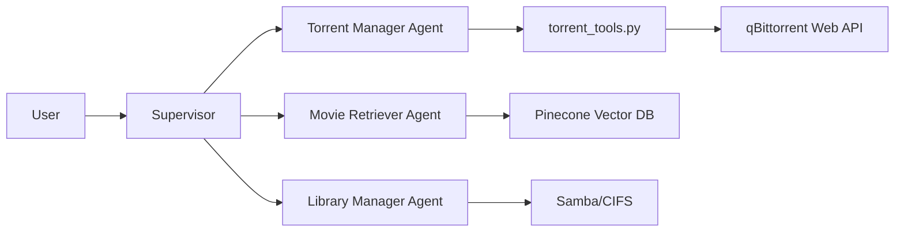
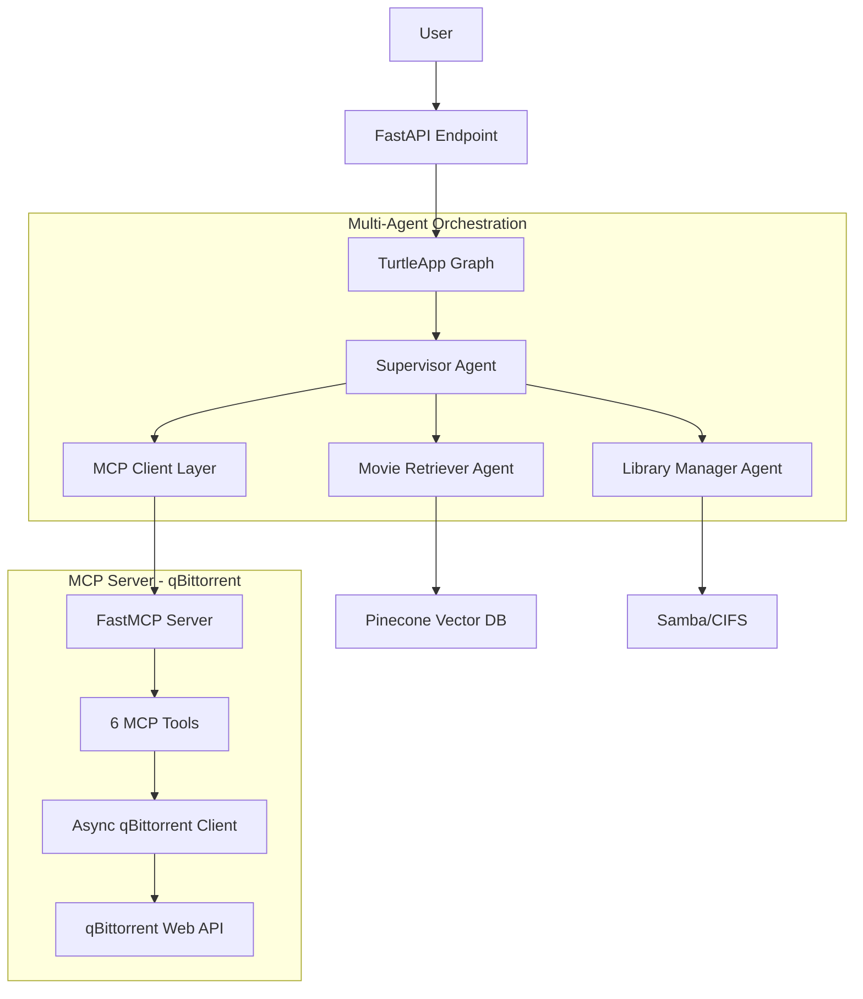

# Turtle App MCP Integration Migration Plan

## Executive Summary

This plan outlines the migration of Turtle App from a monolithic multi-agent system to a modular architecture using Model Context Protocol (MCP). The new architecture will consist of two independent applications under the `@turtleapp/` namespace:

1. **@turtleapp/qbittorrent-mcp**: Standalone MCP server for qBittorrent management
2. **@turtleapp/graph**: Refactored multi-agent graph that consumes the MCP server instead of direct qBittorrent tools

## Current vs. Target Architecture

### Current Architecture (Monolithic)



**Problems:**
- Tight coupling between agents and qBittorrent API
- Direct HTTP calls in tool implementations
- No separation of concerns
- Difficult to reuse qBittorrent functionality
- Mixed synchronous and asynchronous patterns

### Target Architecture (MCP-Based)



**Benefits:**
- Clean separation of concerns via MCP protocol
- Independent deployment and versioning
- Reusable qBittorrent MCP server for other projects
- Consistent async architecture
- Better error handling and type safety
- Easier testing with MCP boundaries

## Migration Strategy

### Phase 1: Repository Restructuring

#### 1.1 Create Monorepo Structure

```bash
turtle_app/
├── packages/
│   ├── qbittorrent-mcp/           # Copied from /home/pie/git/mcp-qbittorrent
│   │   ├── src/
│   │   │   └── mcp_qbittorrent/
│   │   │       ├── server.py
│   │   │       ├── config.py
│   │   │       ├── clients/
│   │   │       ├── tools/
│   │   │       └── models/
│   │   ├── tests/
│   │   ├── pyproject.toml
│   │   └── README.md
│   │
│   └── graph/                      # Refactored from turtleapp/
│       ├── src/
│       │   └── turtleapp_graph/
│       │       ├── api/            # FastAPI endpoints
│       │       ├── core/
│       │       │   ├── nodes/      # Supervisor & agents (NO torrent_agent)
│       │       │   ├── prompts/
│       │       │   ├── tools/      # movie_retriever, library_manager ONLY
│       │       │   └── mcp/        # NEW: MCP client integration
│       │       ├── workflows/      # Graph orchestration
│       │       └── utils/
│       ├── tests/
│       ├── pyproject.toml
│       └── README.md
│
├── build/                          # Docker configs (updated)
├── data_pipeline/                  # Vector store uploads (shared)
├── pyproject.toml                  # Root workspace config
├── CLAUDE.md                       # Updated documentation
└── README.md                       # Updated with new architecture
```

#### 1.2 Package Naming Convention

- **@turtleapp/qbittorrent-mcp**: `turtleapp-qbittorrent-mcp`
- **@turtleapp/graph**: `turtleapp-graph`

### Phase 2: MCP Server Integration

#### 2.1 Copy MCP Server Code

```bash
# Copy mcp-qbittorrent to packages/qbittorrent-mcp
cp -r /home/pie/git/mcp-qbittorrent packages/qbittorrent-mcp

# Update pyproject.toml namespace
# Change: name = "mcp-qbittorrent"
# To:     name = "turtleapp-qbittorrent-mcp"
```

#### 2.2 Update MCP Server Configuration

**File: `packages/qbittorrent-mcp/src/mcp_qbittorrent/config.py`**

```python
# Add turtle app specific settings if needed
class Settings(BaseSettings):
    # Existing qBittorrent settings
    qbittorrent_url: str
    qbittorrent_username: str
    qbittorrent_password: str

    # Add logging integration
    log_level: str = "INFO"

    class Config:
        env_prefix = "TURTLEAPP_QB_"  # Changed from QB_MCP_
```

#### 2.3 Create MCP Server Entry Point

**File: `packages/qbittorrent-mcp/pyproject.toml`**

```toml
[project.scripts]
turtleapp-qb-mcp = "mcp_qbittorrent.server:main"
```

### Phase 3: Graph Refactoring

#### 3.1 Create MCP Client Layer

**File: `packages/graph/src/turtleapp_graph/core/mcp/client.py`**

```python
"""MCP client for qBittorrent server communication."""

import asyncio
from typing import Any, Dict, List, Optional
from mcp import ClientSession, StdioServerParameters
from mcp.client.stdio import stdio_client


class QBittorrentMCPClient:
    """Client for communicating with qBittorrent MCP server."""

    def __init__(self, server_command: List[str]):
        """Initialize MCP client.

        Args:
            server_command: Command to start MCP server
                           e.g., ["uv", "run", "turtleapp-qb-mcp"]
        """
        self.server_command = server_command
        self.session: Optional[ClientSession] = None
        self._context_manager = None

    async def connect(self):
        """Connect to MCP server."""
        server_params = StdioServerParameters(
            command=self.server_command[0],
            args=self.server_command[1:],
        )

        self._context_manager = stdio_client(server_params)
        read, write = await self._context_manager.__aenter__()
        self.session = ClientSession(read, write)
        await self.session.initialize()

    async def disconnect(self):
        """Disconnect from MCP server."""
        if self._context_manager:
            await self._context_manager.__aexit__(None, None, None)

    async def list_torrents(self, filter: Optional[str] = None,
                           category: Optional[str] = None) -> Dict[str, Any]:
        """List torrents via MCP."""
        result = await self.session.call_tool(
            "qb_list_torrents",
            arguments={"filter": filter, "category": category}
        )
        return result.content[0].text  # Parse JSON response

    async def search_torrents(self, query: str, **kwargs) -> Dict[str, Any]:
        """Search torrents via MCP."""
        result = await self.session.call_tool(
            "qb_search_torrents",
            arguments={"query": query, **kwargs}
        )
        return result.content[0].text

    async def add_torrent(self, url: str, **kwargs) -> Dict[str, Any]:
        """Add torrent via MCP."""
        result = await self.session.call_tool(
            "qb_add_torrent",
            arguments={"url": url, **kwargs}
        )
        return result.content[0].text

    async def control_torrent(self, hash: str, action: str,
                             delete_files: bool = False) -> Dict[str, Any]:
        """Control torrent via MCP."""
        result = await self.session.call_tool(
            "qb_control_torrent",
            arguments={
                "hash": hash,
                "action": action,
                "delete_files": delete_files
            }
        )
        return result.content[0].text
```

#### 3.2 Create LangChain Tool Wrappers

**File: `packages/graph/src/turtleapp_graph/core/mcp/tools.py`**

```python
"""LangChain tool wrappers for MCP qBittorrent client."""

import json
from typing import Optional
from langchain_core.tools import BaseTool

from turtleapp_graph.core.mcp.client import QBittorrentMCPClient
from turtleapp_graph.settings import settings


# Global MCP client instance
_mcp_client: Optional[QBittorrentMCPClient] = None


async def get_mcp_client() -> QBittorrentMCPClient:
    """Get or create global MCP client."""
    global _mcp_client
    if _mcp_client is None:
        _mcp_client = QBittorrentMCPClient(
            server_command=settings.mcp.qbittorrent_command
        )
        await _mcp_client.connect()
    return _mcp_client


class TorrentSearchTool(BaseTool):
    """Search for torrents via MCP."""

    name: str = "movie_search"
    description: str = """Search for movie torrents using natural language.

    Use this when users want to:
    - Find movies to download
    - Search for specific films
    - Discover content

    Input: Search query (movie title, year, keywords)
    Returns: List of available torrents with details
    """

    async def _arun(self, query: str, limit: int = 10) -> str:
        client = await get_mcp_client()
        result = await client.search_torrents(
            query=query,
            category="movies",
            limit=limit
        )
        return json.dumps(result, indent=2)

    def _run(self, query: str, limit: int = 10) -> str:
        """Synchronous wrapper (not recommended)."""
        import asyncio
        return asyncio.run(self._arun(query, limit))


class TorrentStatusTool(BaseTool):
    """Check download status via MCP."""

    name: str = "movie_download_status"
    description: str = """Check status of movie downloads.

    Use this when users want to:
    - Check download progress
    - See active downloads
    - Monitor completed downloads

    Input: Optional filter (downloading, completed, paused, all)
    Returns: List of torrents with progress and details
    """

    async def _arun(self, filter: str = "all") -> str:
        client = await get_mcp_client()
        result = await client.list_torrents(filter=filter)
        return json.dumps(result, indent=2)

    def _run(self, filter: str = "all") -> str:
        import asyncio
        return asyncio.run(self._arun(filter))


class TorrentAddTool(BaseTool):
    """Add torrent via MCP."""

    name: str = "movie_add_download"
    description: str = """Add a movie torrent to download queue.

    Use this when users want to:
    - Start downloading a movie
    - Add magnet link or torrent URL

    Input: Torrent URL or magnet link
    Returns: Confirmation message
    """

    async def _arun(self, url: str, category: str = "movies") -> str:
        client = await get_mcp_client()
        result = await client.add_torrent(url=url, category=category)
        return json.dumps(result, indent=2)

    def _run(self, url: str, category: str = "movies") -> str:
        import asyncio
        return asyncio.run(self._arun(url, category))


# Export tool instances
torrent_search_tool = TorrentSearchTool()
torrent_status_tool = TorrentStatusTool()
torrent_add_tool = TorrentAddTool()
```

#### 3.3 Update Agent Configuration

**File: `packages/graph/src/turtleapp_graph/core/nodes/agents.py`**

```python
"""Specialized agents (UPDATED - MCP version)."""

from langchain.agents import create_react_agent, AgentExecutor
from turtleapp_graph.core.tools import (
    movie_retriever_tool,
    library_manager_tool
)
from turtleapp_graph.core.mcp.tools import (
    torrent_search_tool,
    torrent_status_tool,
    torrent_add_tool
)

# Movie retriever - unchanged
movie_retriever_agent = ToolAgent(
    [movie_retriever_tool],
    specialized_prompt=MOVIE_RETRIEVER_PROMPT
)

# Download manager - NOW USES MCP TOOLS
download_manager_agent = ToolAgent(
    [torrent_search_tool, torrent_status_tool, torrent_add_tool],
    name="movies_download_manager",
    specialized_prompt=TORRENT_MANAGER_PROMPT
)

# Library manager - unchanged
library_manager_agent = library_scan_node
```

#### 3.4 Update Settings

**File: `packages/graph/src/turtleapp_graph/settings.py`**

```python
"""Application settings (UPDATED)."""

from pydantic import BaseModel
from pydantic_settings import BaseSettings


class MCPSettings(BaseModel):
    """MCP server connection settings."""
    qbittorrent_command: list[str] = [
        "uv", "run", "turtleapp-qb-mcp"
    ]


class Settings(BaseSettings):
    # Existing settings
    pinecone: PineconeSettings
    openai: OpenAISettings
    models: ModelSettings

    # NEW: MCP configuration
    mcp: MCPSettings = MCPSettings()

    # REMOVED: qbittorrent settings (now in MCP server)
    # qbittorrent: QBittorrentSettings  # DELETE THIS
```

#### 3.5 Update Workflow Graph

**File: `packages/graph/src/turtleapp_graph/workflows/graph.py`**

```python
"""Workflow graph (UPDATED for MCP)."""

from turtleapp_graph.core.nodes import (
    movie_retriever_agent,
    download_manager_agent,  # Now uses MCP
    library_scan_node
)


def create_movie_workflow() -> WorkflowGraph:
    """Create movie workflow graph with MCP integration."""
    agentic_tools = {
        movie_retriever_agent.name: movie_retriever_agent,
        download_manager_agent.name: download_manager_agent,  # MCP-powered
        "library_manager_agent": library_scan_node
    }

    return (WorkflowGraph(tools=agentic_tools, name="Multi-agent Movie Supervisor")
            .compile())
```

### Phase 4: Files to Remove/Archive

#### 4.1 Obsolete Code

Mark as deprecated and remove in final migration:

```
packages/graph/src/turtleapp_graph/core/tools/torrent_tools.py  # OBSOLETE
```

**Contents to remove:**
- `api_call()` function
- `get_torrents()` function
- `search_torrents()` function
- `TorrentDownloadStatusTool` class
- `TorrentSearchTool` class
- All direct qBittorrent API integration code

#### 4.2 Obsolete Tests

```
packages/graph/tests/test_torrent.py  # UPDATE to test MCP integration
```

#### 4.3 Obsolete Settings

Remove from settings.py:
- `QBittorrentSettings` class
- All `QBITTORRENT_*` environment variables

### Phase 5: Testing Strategy

#### 5.1 MCP Server Tests

```bash
# Test MCP server independently
cd packages/qbittorrent-mcp
uv run pytest -v

# Test with real qBittorrent instance
uv run pytest tests/integration/ -v
```

#### 5.2 Graph Integration Tests

**File: `packages/graph/tests/test_mcp_integration.py`**

```python
"""Test MCP integration in graph."""

import pytest
from turtleapp_graph.core.mcp.client import QBittorrentMCPClient
from turtleapp_graph.core.mcp.tools import torrent_search_tool


@pytest.mark.asyncio
async def test_mcp_client_connection():
    """Test MCP client can connect to server."""
    client = QBittorrentMCPClient(["uv", "run", "turtleapp-qb-mcp"])
    await client.connect()

    # Test basic operation
    result = await client.list_torrents()
    assert result is not None

    await client.disconnect()


@pytest.mark.asyncio
async def test_torrent_search_tool():
    """Test LangChain wrapper for MCP tool."""
    result = await torrent_search_tool._arun("Ubuntu 22.04", limit=5)
    assert "results" in result


@pytest.mark.asyncio
async def test_agent_with_mcp_tools():
    """Test agent can use MCP tools."""
    from turtleapp_graph.workflows.graph import create_movie_workflow

    workflow = create_movie_workflow()
    result, _ = workflow.invoke("Search for The Matrix movie")

    assert "search" in result["messages"][-1].content.lower()
```

#### 5.3 End-to-End Tests

```bash
# Start MCP server in background
cd packages/qbittorrent-mcp
uv run turtleapp-qb-mcp &

# Run graph tests
cd packages/graph
poetry run pytest tests/test_mcp_integration.py -v

# Run full workflow test
poetry run pytest tests/test_graph_workflow.py -v
```

### Phase 6: Docker & Deployment

#### 6.1 Update Docker Compose

**File: `build/docker-compose.yml`**

```yaml
services:
  qbittorrent:
    # ... existing qBittorrent config ...

  nas:
    # ... existing Samba config ...

  # NEW: MCP Server
  qbittorrent-mcp:
    build:
      context: ../packages/qbittorrent-mcp
      dockerfile: ../../build/Dockerfile_mcp
    container_name: turtleapp-qb-mcp
    environment:
      - TURTLEAPP_QB_QBITTORRENT_URL=http://qbittorrent:15080
      - TURTLEAPP_QB_QBITTORRENT_USERNAME=admin
      - TURTLEAPP_QB_QBITTORRENT_PASSWORD=adminadmin
    depends_on:
      - qbittorrent
    restart: unless-stopped
    networks:
      - default

  # UPDATED: Graph API
  turtle-app-graph:
    build:
      context: ../packages/graph
      dockerfile: ../../build/Dockerfile_graph
    container_name: turtleapp-graph
    env_file:
      - ../.env.local
    environment:
      # MCP connection via stdio (subprocess)
      - TURTLEAPP_MCP_QBITTORRENT_COMMAND=["uv", "run", "turtleapp-qb-mcp"]
      # Other settings
      - SAMBA_SHARE_PATH=${SAMBA_SHARE_PATH:-daves}
    ports:
      - 8000:8000
    depends_on:
      - qbittorrent-mcp
      - nas
    restart: unless-stopped
    networks:
      - default
```

#### 6.2 Create Dockerfiles

**File: `build/Dockerfile_mcp`**

```dockerfile
FROM python:3.11-slim

WORKDIR /app

# Install uv
RUN pip install uv

# Copy MCP server code
COPY packages/qbittorrent-mcp/ .

# Install dependencies
RUN uv sync

# Expose stdio for MCP communication (no ports needed)
CMD ["uv", "run", "turtleapp-qb-mcp"]
```

**File: `build/Dockerfile_graph`**

```dockerfile
FROM python:3.11-slim

WORKDIR /app

# Install Poetry
RUN pip install poetry

# Copy graph code
COPY packages/graph/ .

# Install dependencies
RUN poetry install --no-dev

# Expose API port
EXPOSE 8000

CMD ["poetry", "run", "turtleapp-graph-server"]
```

### Phase 7: Documentation Updates

#### 7.1 Update CLAUDE.md

```markdown
# CLAUDE.md

## Project Overview

Turtle App is an AI-powered home theater assistant using **MCP-based architecture**
for modular, reusable components.

## Architecture

### Monorepo Structure
- **@turtleapp/qbittorrent-mcp**: Standalone MCP server for qBittorrent
- **@turtleapp/graph**: Multi-agent LangGraph orchestration

### MCP Integration
The graph communicates with qBittorrent via MCP protocol:
- MCP Server: `packages/qbittorrent-mcp/`
- MCP Client: `packages/graph/src/turtleapp_graph/core/mcp/`
- Tools: LangChain wrappers in `core/mcp/tools.py`

## Development Commands

### Start MCP Server
```bash
cd packages/qbittorrent-mcp
uv run turtleapp-qb-mcp
```

### Start Graph API
```bash
cd packages/graph
poetry run turtleapp-graph-server
```

### Run with Docker Compose
```bash
cd build
docker-compose up -d
```

## Key Implementation Patterns

### Adding MCP Tools to Agents
1. Create MCP tool in `qbittorrent-mcp/src/mcp_qbittorrent/tools/`
2. Create LangChain wrapper in `graph/src/turtleapp_graph/core/mcp/tools.py`
3. Add to agent in `graph/src/turtleapp_graph/core/nodes/agents.py`

### MCP Client Lifecycle
- Client initialized lazily via `get_mcp_client()`
- Subprocess spawned for MCP server (stdio communication)
- Session persists across tool calls
```

#### 7.2 Update README.md

Add sections:
- New architecture diagram
- MCP server setup instructions
- Development workflow for monorepo
- Links to package READMEs

### Phase 8: Migration Checklist

#### Pre-Migration
- [ ] Backup current codebase
- [ ] Create feature branch: `feat/mcp-integration`
- [ ] Document all current qBittorrent API calls

#### Phase 1: Setup
- [ ] Create `packages/` directory structure
- [ ] Copy MCP server from `/home/pie/git/mcp-qbittorrent`
- [ ] Update MCP server namespace to `turtleapp-qbittorrent-mcp`
- [ ] Create `packages/graph/` structure

#### Phase 2: MCP Integration
- [ ] Implement `QBittorrentMCPClient`
- [ ] Create LangChain tool wrappers
- [ ] Update agent configuration
- [ ] Remove direct qBittorrent API code

#### Phase 3: Testing
- [ ] Test MCP server independently
- [ ] Test MCP client connection
- [ ] Test LangChain tools
- [ ] Run full integration tests
- [ ] Verify all existing tests pass

#### Phase 4: Docker
- [ ] Create Dockerfile for MCP server
- [ ] Create Dockerfile for graph
- [ ] Update docker-compose.yml
- [ ] Test Docker deployment

#### Phase 5: Documentation
- [ ] Update CLAUDE.md
- [ ] Update README.md
- [ ] Create package READMEs
- [ ] Document MCP architecture

#### Phase 6: Cleanup
- [ ] Remove obsolete `torrent_tools.py`
- [ ] Remove obsolete settings
- [ ] Archive old tests
- [ ] Clean up imports

#### Post-Migration
- [ ] Run full test suite
- [ ] Performance testing
- [ ] Load testing with concurrent requests
- [ ] Production deployment

## Timeline Estimate

| Phase | Tasks | Estimated Time |
|-------|-------|----------------|
| 1 | Repository restructuring | 2-4 hours |
| 2 | MCP server integration | 4-6 hours |
| 3 | Graph refactoring | 6-8 hours |
| 4 | Testing | 4-6 hours |
| 5 | Docker updates | 2-3 hours |
| 6 | Documentation | 2-3 hours |
| **Total** | | **20-30 hours** |

## Risks & Mitigations

### Risk 1: MCP Communication Overhead
**Mitigation**: Use persistent MCP session, connection pooling

### Risk 2: Async/Sync Compatibility
**Mitigation**: Provide both sync/async tool wrappers, use `asyncio.run()` fallback

### Risk 3: Breaking Existing API
**Mitigation**: Maintain API contract, comprehensive integration tests

### Risk 4: Docker Networking Complexity
**Mitigation**: Use stdio for MCP (no network required), clear documentation

## Success Criteria

- [ ] All existing API endpoints work unchanged
- [ ] All tests pass (unit + integration)
- [ ] No direct qBittorrent API calls in graph code
- [ ] MCP server can be used independently
- [ ] Docker Compose deployment works
- [ ] Documentation updated and accurate
- [ ] Performance comparable to or better than current implementation

## Future Enhancements

After successful migration:
1. Add more MCP servers (Plex, Sonarr, Radarr)
2. Create web dashboard that uses MCP servers directly
3. Publish MCP servers as standalone packages
4. Add MCP server discovery and registry
5. Implement MCP server health checks and monitoring
