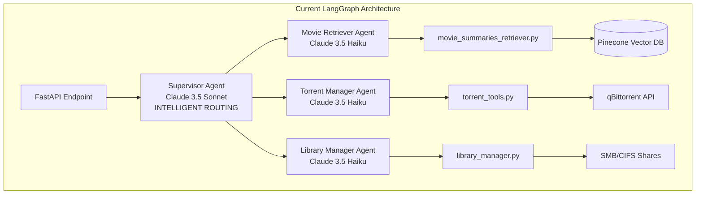
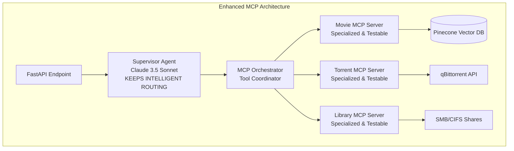
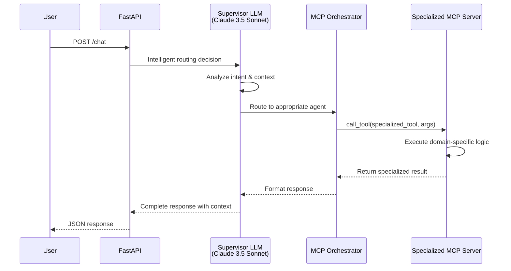

# MCP Integration Plan for Turtle App - Redesigned Technical Specification

## Executive Summary

**Goal**: Enhance the current LangGraph multi-agent architecture with Model Context Protocol (MCP) servers while **preserving intelligent LLM routing** to create a protocol-standard approach with better modularity.

**Key Insight**: The current LangGraph architecture with Claude 3.5 Sonnet supervisor is **excellent**. MCP should make it better, not replace the intelligence.

**Key Benefits**:
- **Keep Intelligence**: Preserve Claude 3.5 Sonnet supervisor for sophisticated routing
- **Protocol Standard**: Replace LangChain tools with MCP servers for better modularity
- **Better Testing**: Test MCP servers independently without losing orchestration
- **Enhanced Architecture**: Specialized MCP servers with intelligent coordination
- **Protocol Compatibility**: Work with any MCP-compatible client while keeping LLM reasoning
- **Deployment Flexibility**: Independent MCP servers with centralized intelligence

## Current vs. Enhanced Architecture

### Current Architecture Analysis

**LangGraph Multi-Agent System** (Current - Working Well):


**Current Strengths** (Keep These):
- ✅ Intelligent LLM-powered routing with Claude 3.5 Sonnet
- ✅ Context-aware decision making and conversation handling
- ✅ Sophisticated understanding of user intent
- ✅ Multi-turn conversation support with memory
- ✅ ReAct agent patterns for complex reasoning

**Areas for Enhancement**:
- Tool modularity and independent testing
- Protocol standardization 
- Deployment flexibility
- Service isolation

### Enhanced MCP Architecture

**Redesigned Architecture** (Preserve Intelligence + Add Protocol Benefits):


**Enhanced Benefits**:
- ✅ **Keep All Intelligence**: Claude 3.5 Sonnet supervisor with sophisticated routing
- ✅ **Protocol Standard**: MCP-compliant specialized servers
- ✅ **Better Modularity**: Each server independently testable and deployable
- ✅ **Preserved Memory**: Keep conversation context and multi-turn support
- ✅ **Enhanced Testing**: Test servers in isolation while keeping orchestration
- ✅ **Deployment Flexibility**: Servers can scale independently

## Detailed MCP Server Specification

### Specialized MCP Servers (Domain-Focused)

**Movie MCP Server** (`movie-server.py`):
```json
{
  "name": "turtle-movie-server",
  "version": "1.0.0",
  "description": "Specialized movie database server with vector search capabilities",
  "capabilities": {
    "tools": true,
    "resources": false,
    "prompts": false
  }
}
```

**Tools**:
- `movie_search(query: str, max_results: int = 5)` - Vector search through 42,000+ movies
- `movie_recommendations(genre: str, limit: int = 5)` - Genre-based recommendations

**Torrent MCP Server** (`torrent-server.py`):
```json
{
  "name": "turtle-torrent-server", 
  "version": "1.0.0",
  "description": "Specialized download management server",
  "capabilities": {
    "tools": true,
    "resources": false,
    "prompts": false
  }
}
```

**Tools**:
- `torrent_search(query: str)` - Search for movie files
- `torrent_download_status()` - Get current download progress
- `torrent_add(magnet_link: str)` - Add new download

**Library MCP Server** (`library-server.py`):
```json
{
  "name": "turtle-library-server",
  "version": "1.0.0", 
  "description": "Specialized local library management server",
  "capabilities": {
    "tools": true,
    "resources": false,
    "prompts": false
  }
}
```

**Tools**:
- `library_scan(force_refresh: bool = False)` - Scan network shares
- `library_stats()` - Get collection statistics
- `library_search(query: str)` - Search local collection

### Enhanced MCP Orchestrator with Existing Prompt Integration

**Intelligent MCP Client** (Preserves LLM Routing + Existing Prompts):
```python
from turtleapp.src.core.llm_factory import create_supervisor_llm
from turtleapp.src.core.prompts.supervisor import SUPERVISOR_PROMPT, SUPERVISOR_SYSTEM_MESSAGE
from turtleapp.src.core.prompts.agents import MOVIE_RETRIEVER_PROMPT, TORRENT_MANAGER_PROMPT
from langgraph.checkpoint.memory import MemorySaver
from mcp.client.stdio import stdio_client

class MCPSupervisorOrchestrator:
    """Enhanced MCP orchestrator that preserves intelligent LLM routing with existing prompts."""
    
    def __init__(self):
        # Keep the intelligent supervisor with existing prompts
        self.supervisor_llm = create_supervisor_llm()  # Claude 3.5 Sonnet
        self.memory = MemorySaver()  # Keep conversation memory
        
        # Use existing supervisor prompt for consistency
        self.supervisor_prompt = SUPERVISOR_PROMPT
        
        # MCP server configurations with specialized prompts
        self.mcp_servers = {
            "movie_details_retriever_agent": {
                "script": "server-examples/movie-server.py",
                "tools": ["movie_search", "movie_recommendations"],
                "prompt_template": MOVIE_RETRIEVER_PROMPT
            },
            "movies_download_manager": {
                "script": "server-examples/torrent-server.py", 
                "tools": ["torrent_search", "torrent_download_status", "torrent_add_download"],
                "prompt_template": TORRENT_MANAGER_PROMPT
            },
            "library_manager_agent": {
                "script": "server-examples/library-server.py",
                "tools": ["library_scan", "library_search", "library_stats"],
                "prompt_template": None  # Direct tool execution for library
            }
        }
    
    async def process_request(self, message: str, thread_id: str = None) -> str:
        """Process request with intelligent routing + MCP execution."""
        
        # Step 1: Use LLM supervisor for intelligent routing (UNCHANGED)
        routing_decision = await self._get_routing_decision(message, thread_id)
        
        # Step 2: Execute via MCP instead of LangChain agent
        if routing_decision.next_agent != "FINISH":
            result = await self._execute_via_mcp(
                routing_decision.next_agent, 
                message,
                thread_id
            )
            
            # Step 3: Continue conversation if needed (preserve multi-turn)
            return await self._handle_response(result, message, thread_id)
        else:
            return routing_decision.response
    
    async def _get_routing_decision(self, message: str, thread_id: str):
        """Use existing LLM supervisor for intelligent routing."""
        # Reuse existing supervisor logic - no changes to intelligence
        return await self.supervisor_llm.invoke({
            "question": message,
            "thread_id": thread_id
        })
    
    async def _execute_via_mcp(self, agent_name: str, message: str, thread_id: str):
        """Execute tool via MCP server instead of LangChain agent."""
        server_script = self.mcp_servers[agent_name]
        
        async with stdio_client(server_script) as (read, write):
            async with ClientSession(read, write) as session:
                await session.initialize()
                
                # Map agent to appropriate MCP tool
                tool_mapping = {
                    "movie_details_retriever_agent": "movie_search",
                    "movies_download_manager": self._determine_torrent_tool(message),
                    "library_manager_agent": "library_scan"
                }
                
                tool_name = tool_mapping[agent_name]
                args = self._prepare_tool_args(tool_name, message)
                
                result = await session.call_tool(tool_name, args)
                return result
```

## Migration Strategy - Enhanced Implementation

### Phase 1: Create Specialized MCP Servers (Day 1-2)

**Objective**: Replace LangChain tools with specialized MCP servers while keeping everything else.

**Implementation**:
1. **Movie Server** (`movie-server.py`)
   - Wrap `movie_retriever_tool` with MCP protocol
   - Add specialized movie tools
   - Independent testing capability

2. **Torrent Server** (`torrent-server.py`)
   - Wrap `torrent_search_tool` and `torrent_download_tool`
   - Add download management capabilities
   - Independent testing capability

3. **Library Server** (`library-server.py`)
   - Wrap `library_manager_tool`
   - Add library statistics and search
   - Independent testing capability

### Phase 2: Create MCP Orchestrator (Day 3-4)

**Objective**: Create orchestrator that preserves LLM intelligence while using MCP servers.

**Implementation**:
1. **Keep Supervisor LLM**
   - Preserve existing Claude 3.5 Sonnet routing
   - Keep conversation memory and context
   - Maintain sophisticated reasoning

2. **Replace Tool Layer**
   - Replace LangChain tool calls with MCP calls
   - Keep all routing logic unchanged
   - Preserve multi-turn conversations

### Phase 3: Integration and Testing (Day 5-6)

**Objective**: Integrate new architecture while preserving all current functionality.

**Implementation**:
1. **API Integration**
   - Update FastAPI endpoint to use MCP orchestrator
   - Keep same request/response models
   - Preserve conversation threading

2. **Testing Strategy**
   - Test individual MCP servers in isolation
   - Test orchestrator with intelligent routing
   - Validate conversation memory and context

## Technical Implementation Details

### Enhanced Message Flow



### Conversation Memory Integration

```python
# Preserve existing memory and context handling
class MCPSupervisorOrchestrator:
    def __init__(self):
        self.supervisor_llm = create_supervisor_llm()
        self.memory = MemorySaver()  # Keep conversation memory
        self.thread_id_generator = create_thread_id  # Keep threading
    
    async def process_request(self, message: str, thread_id: str = None):
        # Preserve conversation context
        if not thread_id:
            thread_id = self.thread_id_generator()
        
        # Get conversation history from memory
        conversation_state = await self.memory.get(thread_id)
        
        # Use supervisor with full context (unchanged)
        routing_decision = await self.supervisor_llm.invoke({
            "question": message,
            "conversation_state": conversation_state,
            "thread_id": thread_id
        })
        
        # Execute and update memory
        result = await self._execute_via_mcp(routing_decision, thread_id)
        await self.memory.put(thread_id, updated_state)
        
        return result
```

## Advantages of Enhanced Architecture

### What We Keep (The Good Stuff)
- ✅ **Intelligent Routing**: Claude 3.5 Sonnet supervisor with sophisticated reasoning
- ✅ **Conversation Memory**: Multi-turn conversations with context
- ✅ **LLM Coordination**: Smart orchestration based on user intent
- ✅ **Complex Reasoning**: Handle edge cases and ambiguous requests
- ✅ **Context Awareness**: Understand conversation flow and history

### What We Gain (The Improvements)
- ✅ **Protocol Standard**: MCP compliance for future integrations
- ✅ **Better Testing**: Test individual servers in isolation
- ✅ **Deployment Flexibility**: Scale servers independently
- ✅ **Service Isolation**: Better fault tolerance and debugging
- ✅ **Tool Modularity**: Clean separation of domain logic

### Performance Analysis

**Enhanced Architecture Performance**:
```
Request Flow:
1. LLM Routing Decision: ~500ms (Claude 3.5 Sonnet)
2. MCP Tool Execution: ~200-800ms (depending on tool)
3. Response Formatting: ~100ms

Total: ~800-1400ms (similar to current, potentially faster due to optimized tool layer)
```

**Key Insight**: We're not trying to reduce LLM calls - we're optimizing the tool execution layer while keeping the valuable intelligence.

## Migration Timeline - Enhanced Implementation Plan

### Phase 1: MCP Server Development (Day 1-2)

**Day 1: Server Foundation**
- [ ] Create specialized MCP server structure
- [ ] Implement movie server with existing tool wrappers
- [ ] Add comprehensive error handling and logging

**Day 2: Server Completion**
- [ ] Implement torrent and library servers
- [ ] Add server-specific optimizations
- [ ] Create independent test suites for each server

### Phase 2: Orchestrator Development (Day 3-4)

**Day 3: Orchestrator Foundation**
- [ ] Create MCP orchestrator that preserves LLM routing
- [ ] Integrate with existing supervisor LLM
- [ ] Preserve conversation memory and threading

**Day 4: Integration & Testing**
- [ ] Connect orchestrator to specialized servers
- [ ] Test intelligent routing with MCP execution
- [ ] Validate conversation context preservation

### Phase 3: Production Integration (Day 5-6)

**Day 5: API Integration**
- [ ] Update FastAPI endpoints to use MCP orchestrator
- [ ] Preserve existing request/response models
- [ ] Add feature flag for gradual rollout

**Day 6: Validation & Deployment**
- [ ] End-to-end testing of all workflows
- [ ] Performance comparison and optimization
- [ ] Documentation and rollout preparation

## Success Metrics and Validation Criteria

### Preserved Functionality
- **Intelligence Parity**: Same quality of routing decisions
- **Conversation Quality**: Multi-turn conversations work identically
- **Feature Completeness**: All current features preserved
- **Response Quality**: Same or better response relevance

### Enhanced Capabilities
- **Server Independence**: Each MCP server testable in isolation
- **Protocol Compliance**: Full MCP standard adherence
- **Deployment Flexibility**: Independent server scaling
- **Error Isolation**: Better fault tolerance

### Performance Targets
- **Response Time**: Similar to current (800-1500ms)
- **Error Rate**: Same or lower than current system
- **Memory Usage**: Optimized through specialized servers
- **Throughput**: Improved through server specialization

## Risk Mitigation and Rollback Strategy

### Low-Risk Migration Approach

**Gradual Migration**:
1. **Feature Flag**: Switch between architectures
   ```python
   USE_MCP_ORCHESTRATOR = os.getenv("USE_MCP_ORCHESTRATOR", "false")
   
   if USE_MCP_ORCHESTRATOR == "true":
       return mcp_supervisor_orchestrator.process_request(message, thread_id)
   else:
       return movie_workflow_agent.invoke(message, thread_id)
   ```

2. **Parallel Testing**: Run both systems simultaneously for comparison
3. **Gradual Rollout**: Start with subset of users/requests

**Rollback Strategy**:
- **Instant Rollback**: Change environment variable
- **Zero Data Migration**: Both systems use same external services
- **Preserved Dependencies**: No breaking changes to current setup

## Detailed Implementation Changes Required

### Current System Analysis

**Existing Architecture (files to modify/integrate with):**
- `turtleapp/src/workflows/graph.py` - Main workflow orchestration using LangGraph
- `turtleapp/api/routes/endpoints.py` - FastAPI REST endpoints
- `turtleapp/src/core/nodes/supervisor.py` - Supervisor agent with Claude 3.5 Sonnet
- `turtleapp/src/core/nodes/agents.py` - ToolAgent wrapper for LangChain tools
- `turtleapp/src/core/tools/` - Individual tool implementations:
  - `movie_summaries_retriever.py` - Pinecone vector search for movies
  - `torrent_tools.py` - qBittorrent integration (search + download status)
  - `library_manager.py` - SMB/CIFS network share scanning

**Key Integration Points:**
1. **Graph Workflow** - `movie_workflow_agent.invoke()` is the main entry point
2. **Memory Management** - Uses LangGraph's `MemorySaver` with thread IDs
3. **LLM Factory** - Centralized LLM creation for supervisor and agents
4. **Tool Orchestration** - `ToolAgent` class wraps tools with ReAct agents

### Phase 1: Create Specialized MCP Servers (Day 1-2)

#### 1.1 Simplified Movie MCP Server 

**File:** `turtleapp/mcp-migration/server-examples/movie-server.py`

**Simplified Synchronous Implementation:**
```python
#!/usr/bin/env python3
"""
Simplified Movie MCP Server for Turtle App
Handles movie-related queries with command-line interface (no async complexity).
"""

import argparse
import logging
from pathlib import Path
import sys

# Add project root to path for imports
project_root = Path(__file__).parent.parent.parent
sys.path.insert(0, str(project_root))

# Import existing Turtle App movie tool
from turtleapp.src.core.tools.movie_summaries_retriever import movie_retriever_tool

logging.basicConfig(level=logging.INFO)
logger = logging.getLogger(__name__)

def execute_movie_search(query: str, max_results: int = 5) -> str:
    """Execute movie search using existing tool."""
    try:
        result = movie_retriever_tool.invoke({
            "query": query,
            "max_results": max_results
        })
        return str(result)
    except Exception as e:
        logger.error(f"Movie search error: {e}")
        return f"Error searching movies: {str(e)}"

def execute_movie_recommendations(query: str, limit: int = 5) -> str:
    """Execute movie recommendations."""
    try:
        # Simple recommendation logic
        if "recommend" in query.lower():
            search_query = f"{query} movie recommendations"
        else:
            search_query = f"movies similar to {query}"
            
        result = movie_retriever_tool.invoke({
            "query": search_query,
            "max_results": limit
        })
        return str(result)
    except Exception as e:
        logger.error(f"Movie recommendations error: {e}")
        return f"Error getting recommendations: {str(e)}"

def main():
    """Simple command-line interface for movie server."""
    parser = argparse.ArgumentParser(description="Turtle Movie MCP Server")
    parser.add_argument("--tool", required=True, choices=["movie_search", "movie_recommendations"])
    parser.add_argument("--query", required=True, help="Search query")
    parser.add_argument("--max-results", type=int, default=5, help="Maximum results")
    
    args = parser.parse_args()
    
    try:
        if args.tool == "movie_search":
            result = execute_movie_search(args.query, args.max_results)
        elif args.tool == "movie_recommendations":
            result = execute_movie_recommendations(args.query, args.max_results)
        else:
            result = f"Unknown tool: {args.tool}"
        
        print(result)
        
    except Exception as e:
        logger.error(f"Server error: {e}")
        print(f"Error: {str(e)}")
        sys.exit(1)

if __name__ == "__main__":
    main()
```

#### 1.2 Simplified Torrent MCP Server

**File:** `turtleapp/mcp-migration/server-examples/torrent-server.py`

**Simplified Synchronous Implementation:**
```python
#!/usr/bin/env python3
"""
Simplified Torrent Management MCP Server for Turtle App
Handles movie download management with command-line interface.
"""

import argparse
import logging
from pathlib import Path
import sys

project_root = Path(__file__).parent.parent.parent
sys.path.insert(0, str(project_root))

# Import existing Turtle App torrent tools
from turtleapp.src.core.tools.torrent_tools import torrent_search_tool, torrent_download_tool

logging.basicConfig(level=logging.INFO)
logger = logging.getLogger(__name__)

def execute_torrent_search(query: str) -> str:
    """Execute torrent search using existing tool."""
    try:
        result = torrent_search_tool.invoke({"search_term": query})
        return str(result)
    except Exception as e:
        logger.error(f"Torrent search error: {e}")
        return f"Error searching torrents: {str(e)}"

def execute_torrent_status() -> str:
    """Execute torrent download status check."""
    try:
        result = torrent_download_tool.invoke({"query": "status"})
        return str(result)
    except Exception as e:
        logger.error(f"Torrent status error: {e}")
        return f"Error checking download status: {str(e)}"

def main():
    """Simple command-line interface for torrent server."""
    parser = argparse.ArgumentParser(description="Turtle Torrent MCP Server")
    parser.add_argument("--tool", required=True, 
                       choices=["torrent_search", "torrent_download_status"])
    parser.add_argument("--query", help="Search query (required for search)")
    
    args = parser.parse_args()
    
    try:
        if args.tool == "torrent_search":
            if not args.query:
                print("Error: --query required for torrent search")
                sys.exit(1)
            result = execute_torrent_search(args.query)
        elif args.tool == "torrent_download_status":
            result = execute_torrent_status()
        else:
            result = f"Unknown tool: {args.tool}"
        
        print(result)
        
    except Exception as e:
        logger.error(f"Server error: {e}")
        print(f"Error: {str(e)}")
        sys.exit(1)

if __name__ == "__main__":
    main()
```

#### 1.3 Simplified Library MCP Server

**File:** `turtleapp/mcp-migration/server-examples/library-server.py`

**Simplified Synchronous Implementation:**
```python
#!/usr/bin/env python3
"""
Simplified Library Management MCP Server for Turtle App
Handles local movie collection management with command-line interface.
"""

import argparse
import logging
from pathlib import Path
import sys

project_root = Path(__file__).parent.parent.parent
sys.path.insert(0, str(project_root))

# Import existing Turtle App library tool
from turtleapp.src.core.tools.library_manager import library_manager_tool

logging.basicConfig(level=logging.INFO)
logger = logging.getLogger(__name__)

def execute_library_scan(force_refresh: bool = False) -> str:
    """Execute library scan using existing tool."""
    try:
        tool_input = {"tool_input": f"scan{' --force' if force_refresh else ''}"}
        result = library_manager_tool.invoke(tool_input)
        return str(result)
    except Exception as e:
        logger.error(f"Library scan error: {e}")
        return f"Error scanning library: {str(e)}"

def execute_library_search(query: str) -> str:
    """Execute library search."""
    try:
        result = library_manager_tool.invoke({"tool_input": f"search {query}"})
        return str(result)
    except Exception as e:
        logger.error(f"Library search error: {e}")
        return f"Error searching library: {str(e)}"

def main():
    """Simple command-line interface for library server."""
    parser = argparse.ArgumentParser(description="Turtle Library MCP Server")
    parser.add_argument("--tool", required=True, 
                       choices=["library_scan", "library_search"])
    parser.add_argument("--query", help="Search query (required for search)")
    parser.add_argument("--force", action="store_true", help="Force refresh for scan")
    
    args = parser.parse_args()
    
    try:
        if args.tool == "library_scan":
            result = execute_library_scan(args.force)
        elif args.tool == "library_search":
            if not args.query:
                print("Error: --query required for library search")
                sys.exit(1)
            result = execute_library_search(args.query)
        else:
            result = f"Unknown tool: {args.tool}"
        
        print(result)
        
    except Exception as e:
        logger.error(f"Server error: {e}")
        print(f"Error: {str(e)}")
        sys.exit(1)

if __name__ == "__main__":
    main()
```

### Enhanced Prompt Integration Strategy

#### Leveraging Existing Prompts in MCP Architecture

**Current Prompt System Analysis:**
- **Supervisor Prompt** (`turtleapp/src/core/prompts/supervisor.py`): Sophisticated routing logic with domain-specific decision rules
- **Agent Prompts** (`turtleapp/src/core/prompts/agents.py`): Specialized ReAct templates for movie retrieval and torrent management
- **Centralized Management** (`turtleapp/src/core/prompts/__init__.py`): Clean imports and path-independent loading

**Key Prompt Assets to Preserve:**
1. **SUPERVISOR_SYSTEM_MESSAGE**: Expert routing rules for 3 agents with detailed decision criteria
2. **MOVIE_RETRIEVER_TEMPLATE**: Movie database expertise with semantic search guidance
3. **TORRENT_MANAGER_TEMPLATE**: Download management with quality preferences and troubleshooting
4. **AGENT_BASE_TEMPLATE**: Standard ReAct format for consistent agent behavior

#### MCP Prompt Enhancement Strategy

**Enhanced MCP Servers with Existing Prompts:**

```python
# Movie Server Enhancement with Existing Prompts
@server.list_tools()
async def handle_list_tools() -> List[Tool]:
    """Enhanced with existing movie retriever knowledge."""
    return [
        Tool(
            name="movie_search",
            description="""Search the movie database using semantic vector search through 42,000+ movie summaries.
            
            Based on existing MOVIE_RETRIEVER_TEMPLATE expertise:
            - Semantic search across movie plots and summaries
            - Detailed knowledge of cast, directors, and crew  
            - Genre classification and movie recommendations
            - Release years and production details
            
            For broad queries, use 5-10 results; for specific movies, use 3-5 results.""",
            inputSchema={
                "type": "object",
                "properties": {
                    "query": {
                        "type": "string",
                        "description": "Search query extracted from user request (movie title, plot description, genre, actor, director)"
                    },
                    "max_results": {
                        "type": "integer",
                        "description": "Number of results based on query specificity (3-5 for specific, 5-10 for broad)",
                        "default": 5,
                        "minimum": 1,
                        "maximum": 20
                    }
                },
                "required": ["query"]
            }
        )
    ]

# Torrent Server Enhancement with Existing Prompts  
@server.list_tools()
async def handle_list_tools() -> List[Tool]:
    """Enhanced with existing torrent manager knowledge."""
    return [
        Tool(
            name="torrent_search",
            description="""Search for movie files available for download.
            
            Based on existing TORRENT_MANAGER_TEMPLATE expertise:
            - Search across multiple movie sources and repositories
            - Prefer higher quality (1080p+) and well-sourced files
            - Always verify movie titles match user requests
            - Handle download troubleshooting""",
            inputSchema={
                "type": "object",
                "properties": {
                    "query": {
                        "type": "string", 
                        "description": "Movie title and year extracted from user request"
                    },
                    "quality_preference": {
                        "type": "string",
                        "description": "Quality preference based on TORRENT_MANAGER guidance",
                        "enum": ["any", "720p", "1080p", "4K"],
                        "default": "1080p"
                    }
                },
                "required": ["query"]
            }
        )
    ]
```

### Phase 2: Simplified MCP Orchestrator (Day 3-4)

#### 2.1 Synchronous MCP Supervisor Orchestrator

**File:** `turtleapp/mcp-migration/client-integration/mcp_orchestrator.py`

**Simplified Synchronous Implementation:**
```python
"""
Simplified MCP Supervisor Orchestrator that preserves LLM intelligence.
Uses synchronous approach for easier implementation and maintenance.
"""

import logging
import subprocess
import json
from typing import Dict, Optional, Any
from pathlib import Path
import sys

# Add project paths
project_root = Path(__file__).parent.parent.parent
sys.path.insert(0, str(project_root))

from pydantic import BaseModel

# Import existing Turtle App components
from turtleapp.src.core.llm_factory import create_supervisor_llm
from turtleapp.src.core.prompts.supervisor import SUPERVISOR_PROMPT
from turtleapp.src.utils.memory_utils import create_thread_id

logger = logging.getLogger(__name__)

class Router(BaseModel):
    """Router response model matching existing supervisor."""
    next_agent: str
    response: Optional[str] = None

class SimpleMCPOrchestrator:
    """Simplified synchronous orchestrator preserving LLM routing."""
    
    def __init__(self):
        # Preserve existing LLM components (no async)
        self.supervisor_llm = create_supervisor_llm()  # Claude 3.5 Sonnet
        self.supervisor_prompt = SUPERVISOR_PROMPT
        
        # Simple MCP server configurations
        self.mcp_servers = {
            "movie_details_retriever_agent": {
                "script": "turtleapp/mcp-migration/server-examples/movie-server.py",
                "default_tool": "movie_search"
            },
            "movies_download_manager": {
                "script": "turtleapp/mcp-migration/server-examples/torrent-server.py",
                "default_tool": "torrent_search"
            },
            "library_manager_agent": {
                "script": "turtleapp/mcp-migration/server-examples/library-server.py", 
                "default_tool": "library_scan"
            }
        }
    
    def process_request(self, message: str, thread_id: Optional[str] = None) -> tuple[str, str]:
        """Process request with intelligent routing + simple MCP execution."""
        
        if not thread_id:
            thread_id = str(create_thread_id())
        
        try:
            # Step 1: Use existing LLM supervisor for routing (simplified)
            routing_decision = self._get_routing_decision(message)
            
            # Step 2: Execute via simple MCP call
            if routing_decision.next_agent != "FINISH":
                result = self._execute_via_mcp_simple(
                    routing_decision.next_agent,
                    message
                )
                return result, thread_id
            else:
                return routing_decision.response or "Task completed.", thread_id
                
        except Exception as e:
            logger.error(f"MCP orchestrator error: {e}")
            return f"Error processing request: {str(e)}", thread_id
    
    def _get_routing_decision(self, message: str) -> Router:
        """Use existing LLM supervisor for routing (synchronous)."""
        
        try:
            # Use existing supervisor prompt (synchronous invoke)
            formatted_prompt = self.supervisor_prompt.format(question=message)
            response = self.supervisor_llm.invoke(formatted_prompt)
            
            # Parse response for routing decision
            if hasattr(response, 'content'):
                content = response.content
            else:
                content = str(response)
                
            # Simple routing logic based on existing supervisor rules
            content_lower = content.lower()
            if "movie_details_retriever_agent" in content_lower or "movie" in content_lower:
                return Router(next_agent="movie_details_retriever_agent")
            elif "movies_download_manager" in content_lower or "download" in content_lower:
                return Router(next_agent="movies_download_manager")
            elif "library_manager_agent" in content_lower or "library" in content_lower:
                return Router(next_agent="library_manager_agent")
            else:
                return Router(next_agent="FINISH", response=content)
                
        except Exception as e:
            logger.warning(f"Routing failed, using movie search: {e}")
            return Router(next_agent="movie_details_retriever_agent")  # Safe fallback
    
    def _execute_via_mcp_simple(self, agent_name: str, message: str) -> str:
        """Execute tool via simple subprocess call to MCP server."""
        
        if agent_name not in self.mcp_servers:
            return f"Unknown agent: {agent_name}"
        
        server_config = self.mcp_servers[agent_name]
        server_script = server_config["script"]
        tool_name = self._determine_tool_name(agent_name, message)
        
        try:
            # Simple subprocess call to MCP server
            cmd = [
                "python", server_script,
                "--tool", tool_name,
                "--query", message
            ]
            
            result = subprocess.run(
                cmd,
                capture_output=True,
                text=True,
                timeout=30  # 30 second timeout
            )
            
            if result.returncode == 0:
                return result.stdout.strip()
            else:
                logger.error(f"MCP server error: {result.stderr}")
                return f"Error from {agent_name}: {result.stderr}"
                
        except subprocess.TimeoutExpired:
            return f"Timeout executing {agent_name}"
        except Exception as e:
            logger.error(f"MCP execution error: {e}")
            return f"Error executing {agent_name}: {str(e)}"
    
    def _determine_tool_name(self, agent_name: str, message: str) -> str:
        """Determine which tool to use (simplified logic)."""
        
        message_lower = message.lower()
        
        if agent_name == "movie_details_retriever_agent":
            return "movie_search"  # Keep it simple
            
        elif agent_name == "movies_download_manager":
            if "status" in message_lower or "progress" in message_lower:
                return "torrent_download_status"
            else:
                return "torrent_search"
                
        elif agent_name == "library_manager_agent":
            if "search" in message_lower:
                return "library_search"
            else:
                return "library_scan"
        
        return "movie_search"  # Safe default
    
    # Main interface matching existing system
    def invoke(self, message: str, thread_id: Optional[str] = None) -> tuple[Dict[str, Any], str]:
        """Synchronous interface matching existing movie_workflow_agent.invoke()."""
        
        result, used_thread_id = self.process_request(message, thread_id)
        
        # Format response to match existing interface
        return {
            "messages": [{"role": "assistant", "content": result}]
        }, used_thread_id
```

### Phase 3: API Integration (Day 5-6)

#### 3.1 Enhanced FastAPI Integration

**File Modifications Required:**

**Update:** `turtleapp/api/routes/endpoints.py`

```python
# Add feature flag import at top
import os

# Add simplified MCP orchestrator import 
from turtleapp.mcp_migration.client_integration.mcp_orchestrator import SimpleMCPOrchestrator

# Initialize simplified MCP orchestrator
mcp_orchestrator = SimpleMCPOrchestrator()

# Modify the _process_chat_request function
def _process_chat_request(message: str, thread_id: Optional[str] = None) -> ChatResponse:
    logger.info(f"Received request: {message}")
    
    # Feature flag for gradual migration
    use_mcp = os.getenv("USE_MCP_ORCHESTRATOR", "false").lower() == "true"
    
    try:
        if use_mcp:
            # Use new MCP orchestrator
            result, used_thread_id = mcp_orchestrator.invoke(message, thread_id)
        else:
            # Use existing LangGraph workflow
            result, used_thread_id = movie_workflow_agent.invoke(message, thread_id)
        
        logger.info(f"Workflow completed successfully for thread: {used_thread_id}")
        
        # Extract response (same for both approaches)
        messages = result.get("messages", [])
        if messages:
            if hasattr(messages[-1], 'content'):
                response_content = messages[-1].content
            else:
                response_content = messages[-1].get('content', str(messages[-1]))
        else:
            response_content = "No response generated"
        
        return ChatResponse(
            response=response_content,
            thread_id=used_thread_id
        )
    
    except Exception as e:
        logger.error(f"Workflow failed: {str(e)}")
        raise HTTPException(
            status_code=500, 
            detail=f"Failed to process request: {str(e)}"
        )
```

#### 3.2 Docker Deployment Configuration

**File:** `turtleapp/mcp-migration/deployment/docker-compose.mcp.yml`

```yaml
version: '3.8'

services:
  turtle-app-mcp:
    build:
      context: ../../..
      dockerfile: Dockerfile
    ports:
      - "8000:8000"
    environment:
      - USE_MCP_ORCHESTRATOR=true
      - CLAUDE_API_KEY=${CLAUDE_API_KEY}
      - OPENAI_API_KEY=${OPENAI_API_KEY}  
      - PINECONE_API_KEY=${PINECONE_API_KEY}
      - QBITTORRENT_HOST=http://qbittorrent:15080
      - SAMBA_SERVER=nas
    depends_on:
      - movie-server
      - torrent-server
      - library-server
      - qbittorrent
      - nas
    volumes:
      - ./server-configs:/app/server-configs
    networks:
      - turtle-network

  movie-server:
    build:
      context: ../../..
      dockerfile: mcp-migration/deployment/Dockerfile.mcp-server
    command: python mcp-migration/server-examples/movie-server.py
    environment:
      - OPENAI_API_KEY=${OPENAI_API_KEY}
      - PINECONE_API_KEY=${PINECONE_API_KEY}
    networks:
      - turtle-network

  torrent-server: 
    build:
      context: ../../..
      dockerfile: mcp-migration/deployment/Dockerfile.mcp-server
    command: python mcp-migration/server-examples/torrent-server.py
    environment:
      - QBITTORRENT_HOST=http://qbittorrent:15080
    depends_on:
      - qbittorrent
    networks:
      - turtle-network

  library-server:
    build:
      context: ../../..  
      dockerfile: mcp-migration/deployment/Dockerfile.mcp-server
    command: python mcp-migration/server-examples/library-server.py
    environment:
      - SAMBA_SERVER=nas
      - SAMBA_SHARE_PATH=daves
    depends_on:
      - nas
    networks:
      - turtle-network

  # Existing infrastructure services
  qbittorrent:
    image: lscr.io/linuxserver/qbittorrent:latest
    ports:
      - "15080:15080"
    environment:
      - WEBUI_PORT=15080
    volumes:
      - ./volumes/qbittorrent:/config
    networks:
      - turtle-network

  nas:
    image: dperson/samba
    ports:
      - "139:139"
      - "445:445"
    environment:
      - USER=dave;password
      - SHARE=daves;/mount/daves;yes;no;yes;dave
    volumes:
      - ./downloads:/mount/daves
    networks:
      - turtle-network

networks:
  turtle-network:
    driver: bridge
```

### Testing Strategy Enhancements

#### Update Test Files

**File:** `turtleapp/mcp-migration/testing/test_mcp_integration.py`

**Add Integration Tests:**
```python
class TestMCPOrchestrator:
    """Test the enhanced MCP orchestrator."""
    
    @pytest.mark.asyncio
    async def test_orchestrator_routing(self):
        """Test that orchestrator preserves intelligent routing."""
        orchestrator = MCPSupervisorOrchestrator()
        
        # Mock LLM responses
        with patch.object(orchestrator.supervisor_llm, 'ainvoke', return_value=Mock(content="movie_details_retriever_agent")):
            routing = await orchestrator._get_routing_decision("Tell me about Inception", "test-thread")
            assert routing.next_agent == "movie_details_retriever_agent"
    
    @pytest.mark.asyncio 
    async def test_memory_preservation(self):
        """Test conversation memory works with MCP."""
        orchestrator = MCPSupervisorOrchestrator()
        thread_id = "test-thread-memory"
        
        # First message
        result1, _ = await orchestrator.process_request("Tell me about action movies", thread_id)
        
        # Second message in same thread should have context
        result2, _ = await orchestrator.process_request("What about the sequel?", thread_id)
        
        # Both should complete without error
        assert "Error" not in result1
        assert "Error" not in result2

class TestPerformanceComparison:
    """Compare MCP vs LangGraph performance."""
    
    def test_response_time_comparison(self):
        """Compare response times between architectures."""
        
        # Test LangGraph approach
        start_time = time.time()
        result1, _ = movie_workflow_agent.invoke("Tell me about The Matrix")
        langgraph_time = time.time() - start_time
        
        # Test MCP approach  
        orchestrator = MCPSupervisorOrchestrator()
        start_time = time.time()
        result2, _ = orchestrator.invoke("Tell me about The Matrix")
        mcp_time = time.time() - start_time
        
        # Both should be reasonable (< 5 seconds)
        assert langgraph_time < 5.0
        assert mcp_time < 5.0
        
        logger.info(f"LangGraph: {langgraph_time:.2f}s, MCP: {mcp_time:.2f}s")
```

### MCP-Specific Prompt Enhancements

#### New MCP Prompts Based on Existing Templates

**File:** `turtleapp/mcp-migration/prompts/mcp_prompts.py`

```python
"""
MCP-specific prompts that extend and adapt existing Turtle App prompts.
Preserves domain expertise while adding MCP protocol awareness.
"""

from turtleapp.src.core.prompts.supervisor import SUPERVISOR_SYSTEM_MESSAGE
from turtleapp.src.core.prompts.agents import MOVIE_RETRIEVER_TEMPLATE, TORRENT_MANAGER_TEMPLATE

# Enhanced MCP Supervisor with existing routing logic
MCP_SUPERVISOR_SYSTEM_MESSAGE = f"""
{SUPERVISOR_SYSTEM_MESSAGE}

**MCP Architecture Context:**
You are now operating with specialized MCP servers instead of ReAct agents:
- Each agent is now a dedicated MCP server with optimized tools
- Tool selection is handled by the MCP orchestrator
- Your routing decisions remain unchanged but execution is more efficient

**Enhanced Routing Rules:**
- Same agent selection criteria as before (preserved from existing SUPERVISOR_SYSTEM_MESSAGE)
- MCP servers provide faster, more specialized tool execution
- Conversation context and memory management preserved

Continue using your existing routing expertise with the same decision criteria.
"""

# Enhanced Movie Server Description (for MCP tool descriptions)
MCP_MOVIE_SERVER_EXPERTISE = """
Based on existing MOVIE_RETRIEVER_TEMPLATE knowledge:

**Domain Expertise:**
- Semantic search across 42,000+ movie plots and summaries
- Detailed knowledge of cast, directors, and crew information
- Advanced genre classification and personalized recommendations
- Historical context including release years and production details

**Search Strategy:**
- Extract key terms from user requests for optimal semantic matching
- Use 3-5 results for specific movie queries
- Use 5-10 results for broad genre or recommendation queries
- Prioritize plot relevance and metadata completeness

**Quality Standards:**
- Present results in organized, user-friendly format
- Include relevant movie details (year, director, cast, plot summary)
- Provide context for recommendations and similar movie suggestions
"""

# Enhanced Torrent Server Description (for MCP tool descriptions)  
MCP_TORRENT_SERVER_EXPERTISE = """
Based on existing TORRENT_MANAGER_TEMPLATE knowledge:

**Download Management Expertise:**
- Search across multiple movie sources and repositories
- Monitor download progress and status with detailed reporting
- Remote download client management and troubleshooting
- Quality assessment and source verification

**Quality Preferences:**
- Prioritize higher quality files (1080p+ preferred)
- Verify movie titles match user requests exactly
- Assess source reliability and file completeness
- Handle download issues and provide actionable guidance

**User Experience:**
- Provide clear, actionable download information
- Extract movie titles and years from user requests
- Monitor multiple downloads with progress tracking
- Troubleshoot common download issues proactively
"""
```

#### Integration with MCP Tool Descriptions

The existing prompts should be integrated into MCP tool descriptions to preserve domain expertise:

```python
# In movie-server.py
Tool(
    name="movie_search",
    description=f"""
    {MCP_MOVIE_SERVER_EXPERTISE}
    
    Semantic vector search through movie database with specialized ranking.
    """,
    # ... rest of tool definition
)

# In torrent-server.py  
Tool(
    name="torrent_search", 
    description=f"""
    {MCP_TORRENT_SERVER_EXPERTISE}
    
    Search for high-quality movie files with source verification.
    """,
    # ... rest of tool definition
)
```

## Simplified Architecture Benefits

### Why Synchronous is Better for This Migration

**Complexity Reduction:**
- No async/await complexity in MCP servers
- Simple command-line interface for each server
- Straightforward subprocess calls instead of async MCP protocol
- Easier debugging and testing

**Implementation Simplicity:**
- Each MCP server is a simple Python script with argparse
- Orchestrator uses synchronous LLM calls (existing pattern)
- No need for async session management or complex MCP client setup
- Direct tool execution with clear error handling

**Maintenance Benefits:**
- Easier to understand and modify
- Simpler deployment (no async runtime requirements)
- Better compatibility with existing synchronous Turtle App architecture
- Reduced dependencies (no full MCP SDK needed)

**Migration Safety:**
- Smaller change surface area reduces risk
- Easier rollback if issues arise
- Gradual migration path with feature flags
- Preserves all existing LLM intelligence and prompts

## Next Steps and Action Items

### Immediate Actions (This Week)
1. **[ ] Environment Setup**: No MCP SDK needed - just standard Python libraries
2. **[ ] Prompt Integration**: Create simplified prompt descriptions for command-line tools
3. **[ ] Server Creation**: Implement the three simplified MCP servers with command-line interfaces
4. **[ ] Orchestrator Development**: Build simplified orchestrator using subprocess calls
5. **[ ] API Integration**: Add feature flag support to existing FastAPI endpoints
6. **[ ] Testing Framework**: Create simple integration tests with subprocess calls

### Implementation Priority
1. **High Priority**: Preserve existing supervisor and agent prompts in MCP architecture
2. **High Priority**: Maintain LLM supervisor intelligence and routing logic  
3. **High Priority**: Ensure conversation memory and thread management continuity
4. **High Priority**: Feature flag allows safe rollback to existing LangGraph system
5. **Medium Priority**: Enhance MCP tool descriptions with existing domain expertise
6. **Medium Priority**: Optimize individual MCP server performance with prompt guidance
7. **Medium Priority**: Docker deployment configuration
8. **Low Priority**: Advanced MCP features and monitoring

## Conclusion

This redesigned migration plan **enhances** your excellent existing architecture instead of replacing it. We keep:

- **The Intelligence**: Claude 3.5 Sonnet supervisor with sophisticated reasoning
- **The Context**: Conversation memory and multi-turn support  
- **The Quality**: Same high-quality user experience

While gaining:

- **Protocol Standards**: MCP compliance and modularity
- **Better Testing**: Independent server validation
- **Deployment Flexibility**: Scalable, isolated services
- **Future-Proofing**: Standards-based architecture

The key insight is that **your current architecture is excellent** - MCP should make it better, not simpler.